tags:: session

- # Organisation
  collapsed:: true
	- course materials
	  collapsed:: true
		- {{embed ((643f8bfc-4718-417d-a94f-c5d69dd55657))}}
	- registration
	  id:: 643f815f-94c1-4baf-b4da-4dfbc8a14e46
	  collapsed:: true
		- Modulprüfung
		- 3 or 6 ECTS?
		- open issues?
	- requirements
	  collapsed:: true
		- {{embed ((643f9161-7138-4163-b0f8-3d4062c3d0a2))}}
	- course description
	  collapsed:: true
		- {{embed ((643f2336-49a4-4364-b906-c9632e169d1a))}}
	- course concept
	  collapsed:: true
		- {{embed ((643f2336-e267-4976-9017-68fc5b30e5b5))}}
	- course schedule
	  collapsed:: true
		- {{embed ((643f2336-673c-4882-afe2-ede089a86ea0))}}
- # Course overview
  id:: 643f8370-b798-4ba7-be84-df4f12efc6ab
	- [[note-taking]]
	  collapsed:: true
		- the principle of networked notes
		- Using [[logseq]]
			- a knowledge graph
			  collapsed:: true
				- 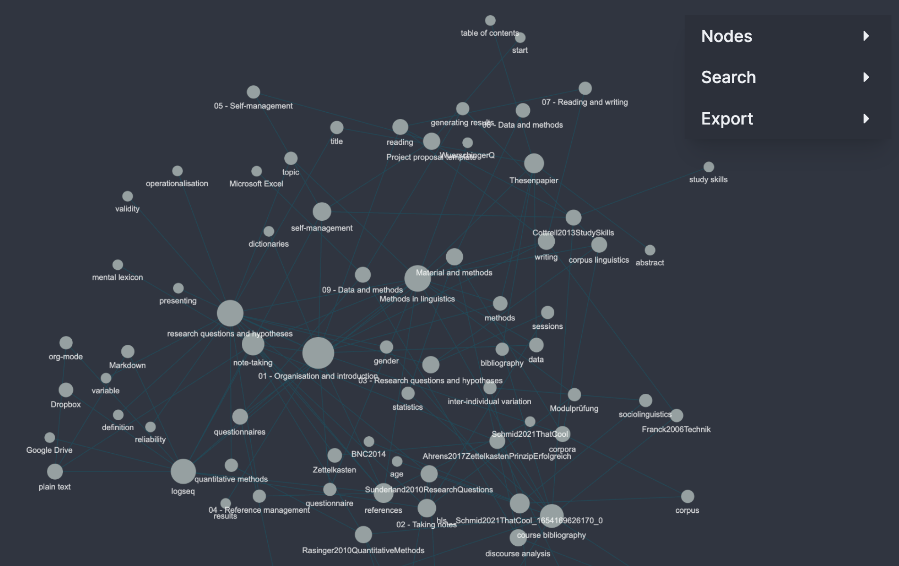
			- taking notes on [[references]]
			  collapsed:: true
				- 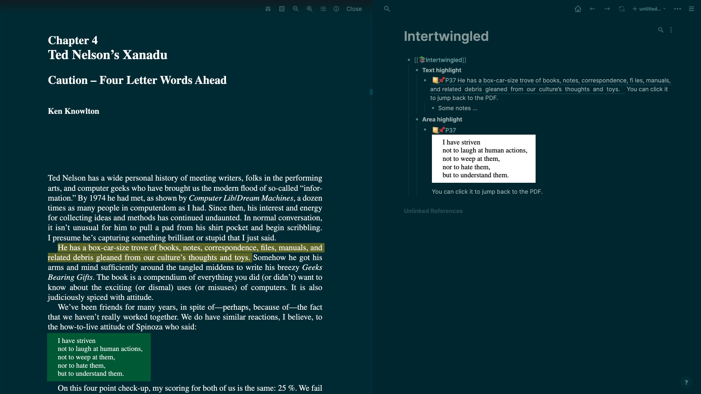
	- [[research questions and hypotheses]]
	  collapsed:: true
		- 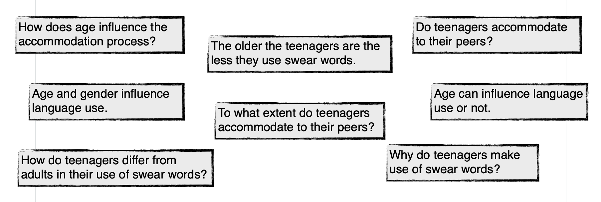
	- [[references]] management
	  collapsed:: true
		- 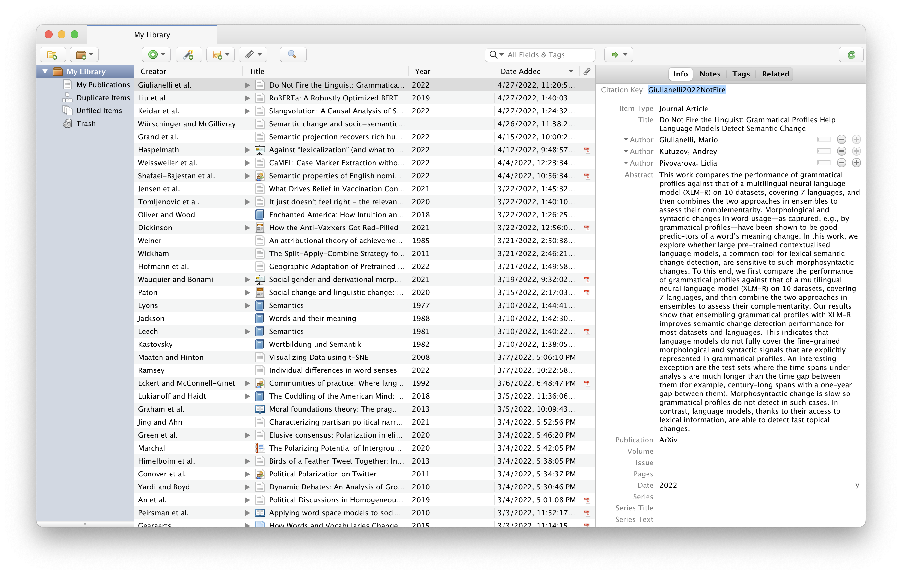
	- [[self-management]]
	  collapsed:: true
		- 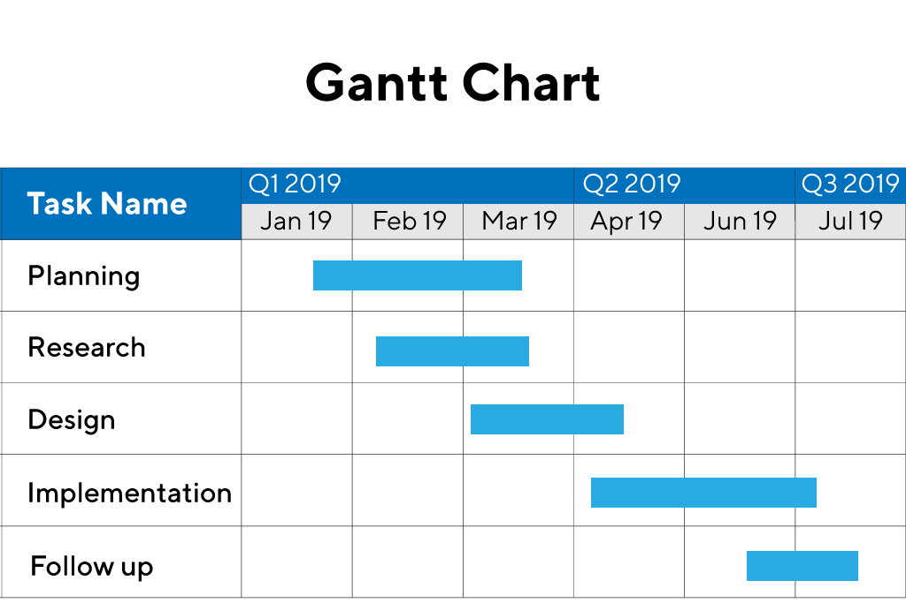
	- [[reading]] and [[writing]]
	  collapsed:: true
		- [[writing]]
		  collapsed:: true
			- 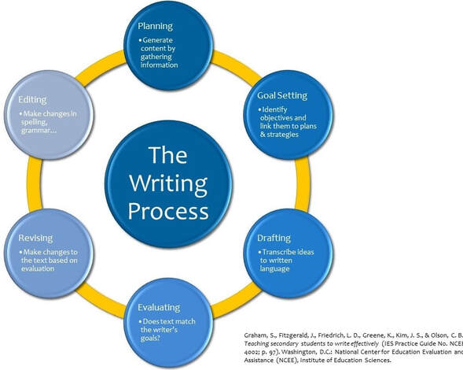
			- [[tools]]
				- [[Microsoft Word]]
				- [[Quarto]]
	- [[presenting]]
	  collapsed:: true
		- 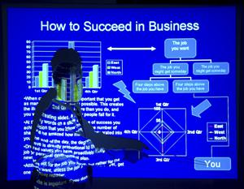
	- linguistic [[data]] and [[methods]]
	  collapsed:: true
		- [[dictionaries]]
		  collapsed:: true
			- [[Urban Dictionary]]
			- [[Wiktionary]]
			- [[OED]]
				- 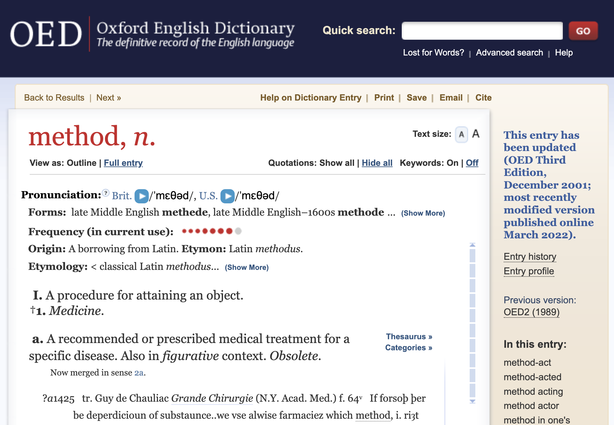
				  collapsed:: true
					- [[etymology]]
					- [[language contact]]
					- [[lexicography]]
					- [[IPA transcription]]
		- [[corpora]]
		  collapsed:: true
			- [[Sketch Engine]]
			  collapsed:: true
				- 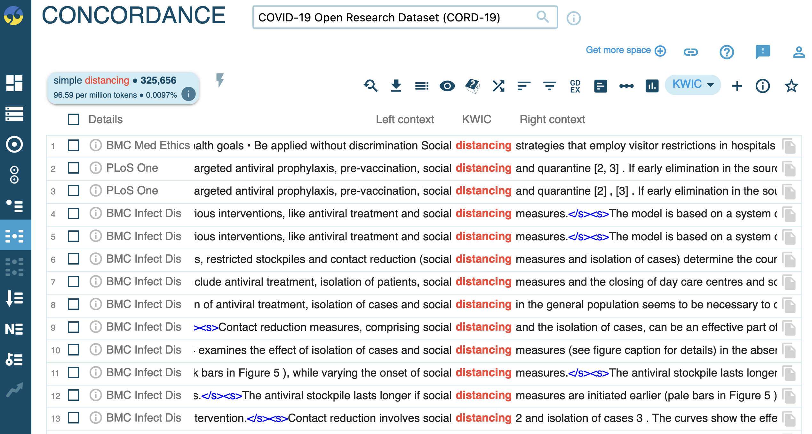
			- [[english-corpora.org]]
			  collapsed:: true
				- 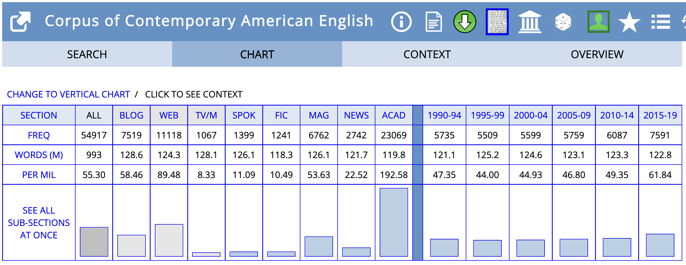
		- [questionnaires]([[questionnaire]])
		  collapsed:: true
			- 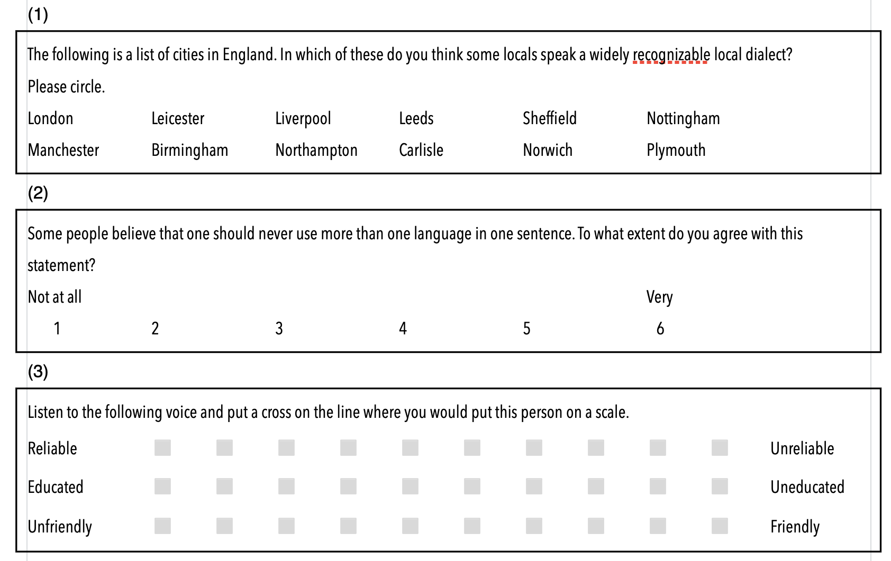
	- [[data analysis]]
	  collapsed:: true
		- using [[Microsoft Excel]]
		  collapsed:: true
			- using [[tables]]
			  collapsed:: true
				- {:height 379, :width 659}
			- using [[pivot tables]]
			  collapsed:: true
				- {:height 492, :width 640}
			- creating [[plots]] for [[visualisation]]
			  collapsed:: true
				- 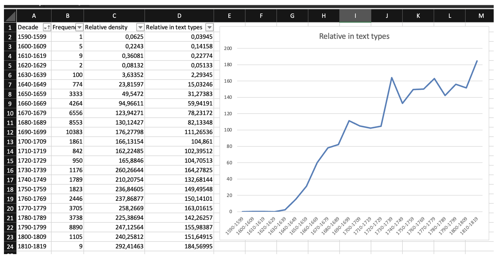
	- presenting [[results]]
	  collapsed:: true
		- 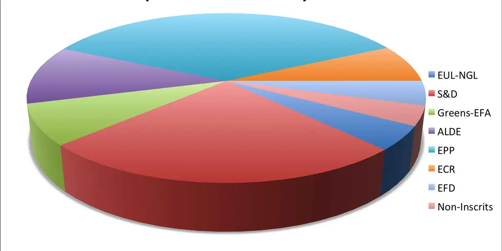
- # Motivations, expectations, and goals
	- What is your background?
		- previous experience, study programme, field of linguistics, etc.
	- What kind of a project are you going to work on?
		- **type**: term paper, BA thesis, Zulassungsarbeit etc.
			- [[Modulprüfung/Seminar]]
				- Linguistic landscapes
					- Uli Krischke
				- Sociolinguistics
					- Laura Hahn
				- Online pragmatics
					- Jenny Arendholz
				- Etymology
					- Ellen Danielewicz
		- **domain**: (linguistic) field, supervisor
		- **deadline**: when are you planning to conduct and finish your project?
	- Which topic are you planning to write your paper about?
	- Which data and methods are you planning to use?