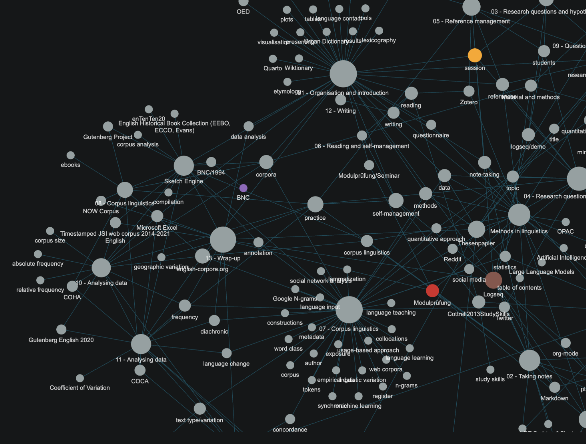
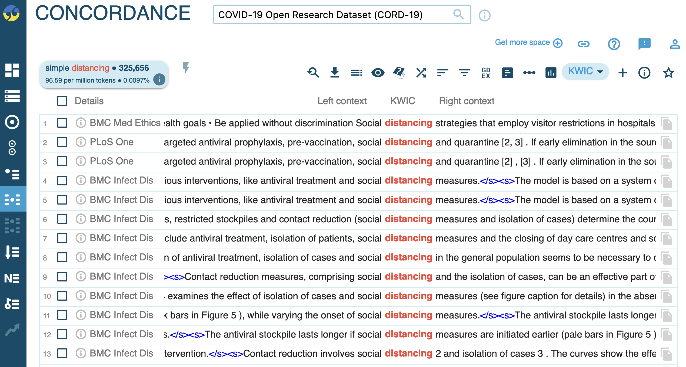
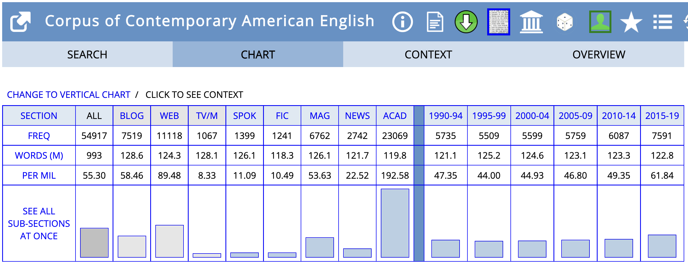
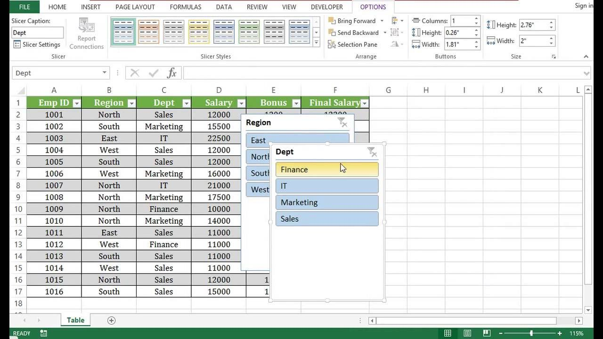
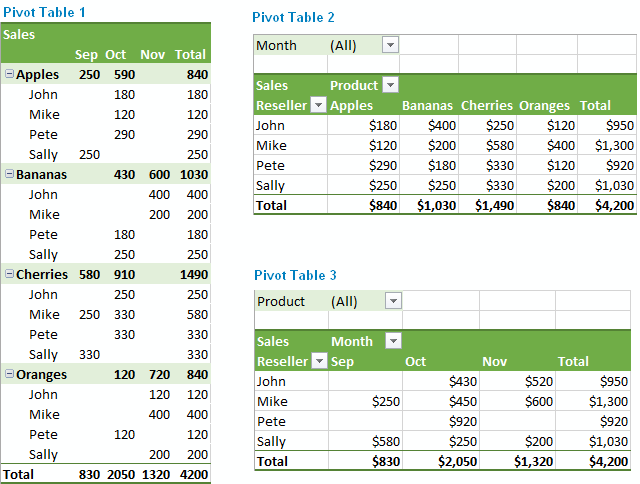
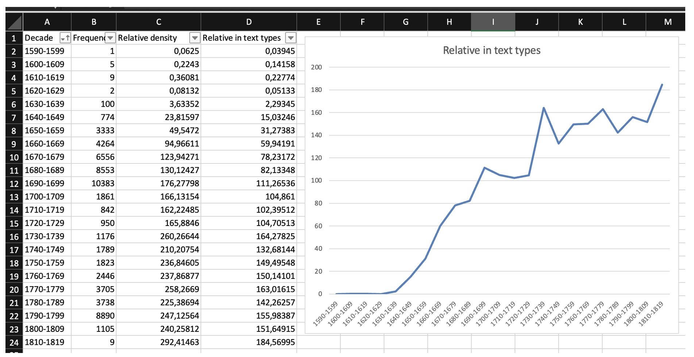

- organisation
	- course materials
	  collapsed:: true
		- {{embed ((643f8bfc-4718-417d-a94f-c5d69dd55657))}}
	- registration
	  collapsed:: true
		- 3 or 6 ECTS?
		- [[Modulprüfung]]?
			- Lexis and grammar (Handl)
			- English etymology (Flaksmann)
		- open issues?
	- requirements
	  collapsed:: true
		- {{embed ((643f9161-7138-4163-b0f8-3d4062c3d0a2))}}
	- course concept
	  collapsed:: true
		- {{embed ((643f2336-e267-4976-9017-68fc5b30e5b5))}}
	- schedule
	  collapsed:: true
		- {{embed ((66291f0f-e629-4a65-8096-42f4387070cd))}}
		-
- introduction
  id:: 662a5dac-8887-40a3-b0e5-f7bf2a84b709
	- note-taking
	  collapsed:: true
		- [[mental lexicon]]
		  collapsed:: true
			- 
		- networked notes
		  collapsed:: true
			- 
		- graph views (tools: e.g. [[Obsidian]] and [[Logseq]])
		  collapsed:: true
			- 
		- the Zettelkasten method (Niklas Luhmann)
		  collapsed:: true
			- 
			  collapsed:: true
			  [[Ahrens2017ZettelkastenPrinzip]]
	- [[research questions and hypotheses]]
	  collapsed:: true
		- 
	- [[references]] management
	  collapsed:: true
		- 
		  [[Zotero]]
	- [[self-management]]
	  collapsed:: true
		- 
	- [[06 – Reading]] and [[writing]]
	  collapsed:: true
		- 
	- [[presenting]]
	  collapsed:: true
		- {:height 478, :width 652}
	- linguistic [[data]] and [[methods]]
	  collapsed:: true
		- [[dictionaries]]
		  collapsed:: true
			- [[Urban Dictionary]]
			- [[Wiktionary]]
			- [[OED]]
			  collapsed:: true
				- 
		- [[corpora]]
		  collapsed:: true
			- [[Sketch Engine]]
			  collapsed:: true
				- 
			- [[english-corpora.org]]
			  collapsed:: true
				- 
		- [[questionnaires]]
		  collapsed:: true
			- 
	- [[data analysis]]
	  collapsed:: true
		- using [[Microsoft Excel]]
		  collapsed:: true
			- using tables
			  collapsed:: true
				- 
			- using pivot tables
			  collapsed:: true
				- 
			- creating visualisations
			  collapsed:: true
				- 
		- presenting [[results]]
		  collapsed:: true
			- 
- motivations, expectations, and goals
	- What is your background?
	  collapsed:: true
		- previous experience, study programme, field of linguistics, etc.
	- What kind of a project are you going to work on?
	  collapsed:: true
		- **type**: term paper, BA thesis, Zulassungsarbeit etc.
		- **domain**: (linguistic) field, supervisor
		- **deadline**: when are you planning to conduct and finish your project?
	- Which topic are you planning to write your paper about?
	- Which data and methods are you planning to use?