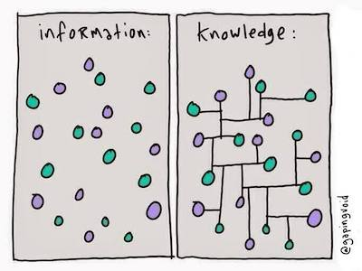
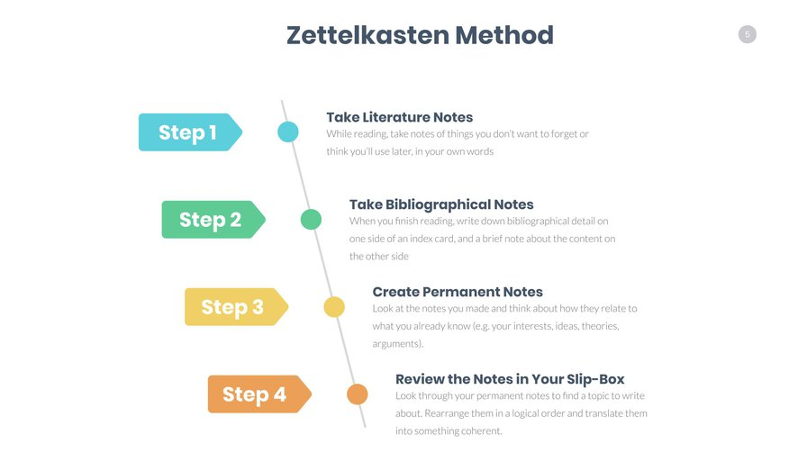

- organisation
  collapsed:: true
	- registration
	  collapsed:: true
		- {{embed ((643f815f-94c1-4baf-b4da-4dfbc8a14e46))}}
	- [[Modulprüfung]]
	- requirements
	  collapsed:: true
		- {{embed ((643f9161-7138-4163-b0f8-3d4062c3d0a2))}}
- course overview
  collapsed:: true
	- {{embed ((643f8370-b798-4ba7-be84-df4f12efc6ab))}}
- [[note-taking]]
	- principles
		- plain text
		  collapsed:: true
			- {{embed [[plain text]]}}
		- networked notes
		  id:: 6451ff83-844b-4d58-8d7f-95ce3bd20491
			- the principle
			  id:: 6451ff83-befc-44c6-809d-554717158ba4
				- [[mental lexicon]]
					- 
				- networked notes
					- 
			- [[Zettelkasten]] method
				- 
				- **origin**: sociologist Niklas Luhmann
				- **book**: [[Ahrens2017ZettelkastenPrinzipErfolgreich]]
				- **website**: https://zettelkasten.de/
	- tools
		- free options (recommended)
			- [[logseq]]
			- [Obsidian](https://obsidian.md/)
		- paid: [Notion](https://www.notion.so/)
	- [[practice]] : taking notes using [[logseq]]
	  id:: 6451ff83-b00d-4123-8162-fc21975095b9
		- DONE install logseq from their [website](https://logseq.com/)
		- DONE create a new graph
		- DONE start with the [template]([[student page]]) for your personal page
			- DONE download `student page.md` ([[Markdown]] format) from our shared folder [here](https://syncandshare.lrz.de/getlink/fiNpRN4FB9181jt53gvaxB/)
			- DONE copy it the `pages` folder in your graph directory
			- DONE name it using your second name + first name’s initial, e.g. `WuerschingerQ`
		- TODO fill in the template
			- TODO answer the questions provided
			- TODO link to important concepts and keywords (e.g. [[corpus linguistics]], [[Twitter]])
		- TODO upload your personal page to our shared folder [here](https://syncandshare.lrz.de/getlink/fiNpRN4FB9181jt53gvaxB/) on [[LRZ Sync and Share]]