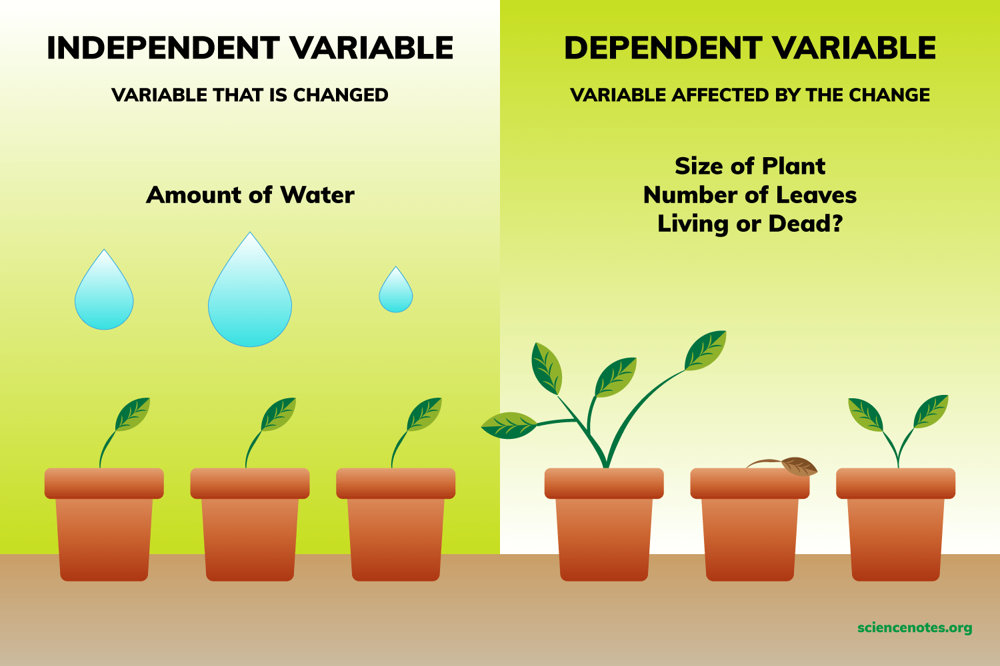
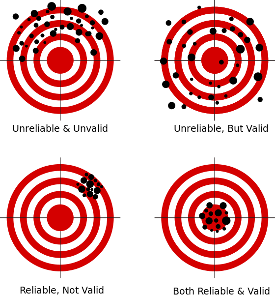

- taking notes using Logseq
  collapsed:: true
	- {{embed ((6451ff83-b00d-4123-8162-fc21975095b9))}}
- [[topic]]
  collapsed:: true
	- What is a topic?
	  collapsed:: true
		- a more general account of what your are interested in
		- a vague formulation of your project
		- the area and discipline you are working in
		- *example*: The language of teenagers
	- What is a good topic?
	  id:: 64520404-74aa-4626-bb11-7c2bb787940f
	  collapsed:: true
		- is not too general but also not too specific
		- should have further relevance for linguistics
		- includes new aspects based on state of the art in the relevant theories
		- interesting and doable
		- is based on previous knowledge and/or observations
		- allows for a number of research questions
	- example: loanwords in fashion
	  collapsed:: true
		- [[OCR]]: Optical Characer Recognition
			- example app: Adobe Scan
		- [[LLMs]]
			- [[Whisper]] by OpenAI for transcribing audio
			- good alternative to [[ChatGPT]] is Anthropic’s [[Claude]]
- [[title]]
  collapsed:: true
	- is the business card of your paper/thesis
	- must be informative and explicit
	- must have a reasonable link to the content
	- must not raise expectations that are not met in the paper
	- it’s often good to use a subtitle
	- example: *Teenage talk - a sociolinguistic study of the forms and functions of youth language*
- [[research questions]] (RQ)
  id:: 62862ae8-dcf3-49f6-b9b4-0a7fe71fdcce
	- determine your aim(s)
	  collapsed:: true
		- Your topic and a preliminary title in mind,
		- you work out a set of research questions and/or hypotheses
		- suitable
			- to be applied to empirical data (operationalisation) or
			- to challenge theoretical positions.
	- the importance of RQ
	  collapsed:: true
		- RQ is important for choosing & evaluating empirical data and theoretical concepts & literature
		  collapsed:: true
			- > This is because a piece of empirical research is normally designed to address one or more research questions – the answers to which should constitute a “contribution to knowledge”. ([[Sunderland2010ResearchQuestions]]: p. 10)
		- start out with RQ as a guideline for your project: it can be a rather broadly formulated RQ, but also a number of relatively small and precise RQs
		- while progressing, refine your RQs, make them more precise or more general or add new ones
		- don't miss the point where your RQs have to be fixed
	- how to find RQs
	  collapsed:: true
		- from observation
		- from [[references]]
		  collapsed:: true
			- by coming across a suggestion for desiderata / unanswered questions
			- by replicating someone else's work
			- by identifying a gap, i.e. something that has not yet been asked
		- from own empirical findings within the study
	- the scope of a RQ
	  collapsed:: true
		- is more exploratory and broader than a [[hypothesis]]
		- interrogative, addresses a part of the [[topic]];
	- types of RQs ([[Sunderland2010ResearchQuestions]]: 13ff.)
	  collapsed:: true
		- according to its **function**, a research question (RQ) can be:
		  collapsed:: true
			- descriptive
			  collapsed:: true
				- descriptive research questions aim to **accurately and systematically** describe a phenomenon, situation, or condition. They are concerned with the "what", "where", and "when" aspects, helping to detail characteristics or functions of language in specific contexts.
			- explanatory
			  collapsed:: true
				- explanatory research questions seek to clarify the **reasons** behind a phenomenon or to elucidate **relationships** among elements of the study. They often address the "why" or "how" something happens, particularly in theoretical linguistics to explain language structures or functions.
			- evaluative
			  collapsed:: true
				- evaluative research questions focus on assessing the **effectiveness** or value of language components, programs, or methodologies. These questions are crucial in applied linguistics for determining the impact of educational interventions or language policies.
			- causal-comparative
			  collapsed:: true
				- causal-comparative research questions explore the **cause-and-effect** relationships by comparing two or more groups that differ on a particular variable to discover influences on linguistic behavior or traits. This approach is used to investigate the effects of various linguistic factors without manipulating variables.
			- correlational
			  collapsed:: true
				- correlational research questions examine whether, and to what degree, a **relationship exists between two or more quantifiable variables**. In linguistics, this might involve studying the relationships between language exposure and proficiency, or the correlation between age and language acquisition rates.
		- according to its **relation** to the project, a research question (RQ) can be:
		  collapsed:: true
			- primary vs. secondary
			  collapsed:: true
				- primary research questions drive the **core aim** of the project, focusing on the main issues or objectives to be investigated.
				- Secondary research questions support the primary ones, providing **additional details** or exploring **related aspects**.
			- main vs. contributory
			  collapsed:: true
				- main research questions are central to the purpose of the research and determine the **primary focus** of the study.
				- contributory research questions help in addressing the main questions by exploring **additional facets** or contributing **secondary data**.
			- overarching vs. subordinate
			  collapsed:: true
				- Overarching research questions encompass the **broad goals** of the research project, setting a wide framework.
				- Subordinate research questions fit within this framework, addressing **more specific** elements that feed into the overarching question.
			- empirical vs methodological vs theoretical
			  collapsed:: true
				- Empirical research questions are concerned with **testing hypotheses** or observing phenomena in real-world settings.
				- Methodological questions focus on the **techniques** and **tools** of the research,
				- and theoretical questions aim to explore and develop underlying **theories or models**.
			- researcher-generated vs. participant-generated
			  collapsed:: true
				- Researcher-generated research questions are formulated **by the researchers** based on their scholarly expertise and research goals.
				- Participant-generated questions arise from the interests or experiences of the **participants** involved in the study.
			- empirical vs. speculative
			  collapsed:: true
				- Empirical research questions are based on **observable and measurable evidence**, requiring data to answer.
				- Speculative research questions are based on **conjectures or assumptions**, often exploring what could happen under hypothetical scenarios.
	- how to formulate RQs
	  id:: 62862ae8-6376-4d82-b9e5-37b518baf1af
	  collapsed:: true
		- be careful with the **wording**:
		  collapsed:: true
			- you must have exact definitions for every content word;
			- it has to be understandable by others
			- it should be a question
		- the **number** of RQs is not restricted, start with many and narrow down, but they must be manageable – if in doubt, leave out!
		- the **sequence** of your RQs may be important
	- structure
	  collapsed:: true
		- RQ: …
			- RQ1: …
				- HYPO1.1: …
				- HYPO1.2: …
			- RQ2: …
				- HYPO2.1: …
- [[hypotheses]]
  id:: 66291f12-2b45-4d0f-b63a-0718eeafd06c
	- [[definition]]
	  collapsed:: true
		- > Hypothesen sind also Antworten auf die Fragen, die implizit mit dem gewählten Thema aufgeworfen werden. Um als wissenschaftliche Hypothesen zu taugen, müssen sie sich als Ergebnisse ausweisen, die durch ein wissenschaftliches Untersuchungsverfahren gewonnen wurden ([[Esselborn2002IdeeText]]: 101)
	- characteristics
		- H is a **prerequisite** for drawing a conclusion;
		  collapsed:: true
			- the assumed answer to a question;
			- generally valid claim;
			- assumption about real phenomena;
			- a prediction of what you will find
		- H are particularly prominent in
		  collapsed:: true
			- the natural sciences,
			- in experimental studies and
			- more often in quantitative research
		- The **Null Hypothesis**: a special case in negative form
		  collapsed:: true
			- stating that the differences observed have occurred only because of chance, i. e. there is no [correlation]([[correlation]]) between two [variables]([[variable]])
			- Research then aims to reject (or accept) the Null Hypothesis.
			- 
		- H is often more precise than an RQ
		- H is a statement to be confirmed or refuted
		- H is a statement about the potential relation between at least two variables
		- H must be falsifiable (i.e. must not be a tautology)
		- can be operationalised ([[operationalisation]])
- important criteria for good [[research questions]] and [[hypotheses]]
  id:: 66291f12-f76c-4c68-83e7-edd329fbd8b1
	- [[variable]]: “feature of a particular case, and a particular case can take one of a set of possible features” ([[Rasinger2010QuantitativeMethods]]: 53)
	  collapsed:: true
		- *Example*: [[gender]]: variable with two (or more) values, each case (in a class of 20 pupils=cases) can take only one of the possible values.
		- independent vs. dependent [[variable]]
		  collapsed:: true
			- 
	- [[operationalisation]]: translating properties of the studied phenomenon into numerical values, especially in [[quantitative methods]]
	- [[reliability]]: study has to be replicable, results have to be consistent, i.e. investigating the same aspects under identical/similar conditions returns the same results
	- [[validity]]: method has to be appropriate, i.e. the chosen method has to actually measure what it is supposed to measure.
	  collapsed:: true
		- *internal* validity: results of an experiment not skewed by non-intended factors
		- *external* validity: question of generalisation of the results to larger populations
	- the relationship between [[reliability]] and [[validity]]
	  collapsed:: true
		- 
- [[practice]]: work towards your own research questions and hypotheses
  collapsed:: true
	- identify a [[topic]]
	- come up with a preliminary [[title]]
	- identify one or more [[research questions]]
	- identify one or more [[hypotheses]]
	- take notes
	- discuss with fellow students (with similar interests)
- notes
  collapsed:: true
	- working with [[audio]] data
		- use [[YouTube]]
		- transcribe using AI (e.g. [[Whisper]] )