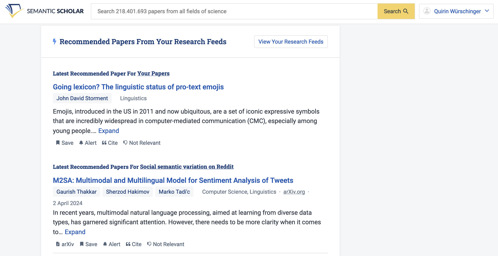
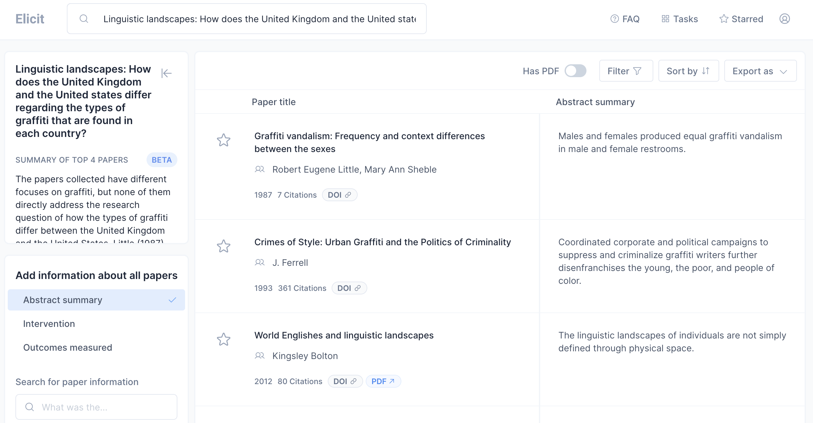

- managing [[references]]
	- finding references
	  collapsed:: true
		- libraries
		  collapsed:: true
			- LMU
			  collapsed:: true
				- [OPAC](https://www.ub.uni-muenchen.de/suchen/online-katalog/index.html)
				  collapsed:: true
					- 
				- [databases](https://www.ub.uni-muenchen.de/suchen/datenbanken/index.html)
				  collapsed:: true
					- ==Linguistics and Language Behavior Abstracts (LLBA)==: This database focuses on abstracts from approximately 2,000 journals dedicated to the study of linguistics and related disciplines. It also provides summaries of books, book chapters, dissertations, and conference papers.
					- ==MLA International Bibliography==: Produced by the Modern Language Association, this database includes citations from journals, books, and dissertations focused on literature, language, linguistics, and folklore.
					- ==JSTOR==: JSTOR is a multidisciplinary digital library containing a large amount of academic content. Its linguistics section includes a range of resources from academic journals, books, and primary sources.
					- ==ProQuest==: ProQuest is a multidisciplinary research database, providing a variety of resources, including magazines, journals, newspapers, and more. It contains a wide range of materials in the field of linguistics.
					- ==ScienceDirect==: ScienceDirect, from Elsevier, provides full text access to over 2,500 journals and 11,000 books. It includes plenty of resources related to linguistics.
					- ==John Benjamins e-Platform==: This platform provides a broad range of material across various linguistic sub-disciplines. It's particularly known for its publications in theoretical and functional linguistics, psycholinguistics, and semantics.
					- ==Oxford University Press Journals==: Oxford University Press publishes several important and prestigious journals in the field of linguistics.
					- ==Cambridge Core==: This is the place to find a range of linguistics journals published by Cambridge University Press, which covers all aspects of the study of language, from phonetics, phonology and syntax, to sociolinguistics and psycholinguistics.
					- ==Wiley Online Library==: Wiley publishes a range of peer-reviewed journals in the field of linguistics, including cognitive linguistics, sociolinguistics, and applied linguistics.
					- ==Ethnologue==: While not a traditional academic database, Ethnologue is a comprehensive reference work cataloging all of the world's known living languages. It's very useful for linguistic ethnography and studies of language diversity.
			- Bayerische Staatsbibliothek (BSB)
			  collapsed:: true
				- [OPAC](https://opacplus.bsb-muenchen.de/metaopac/start.do)
				  collapsed:: true
					- {:height 436, :width 628}
		- web
		  id:: 6463abc3-0579-42db-a65b-ccff44da6659
		  collapsed:: true
			- [Google Scholar](https://scholar.google.com/)
			- [OpenAlex](https://alpha.openalex.org/works)
			  collapsed:: true
				- [[open source]] alternative to Google Scholar
			- [Semantic Scholar](https://www.semanticscholar.org/me/research)
			  collapsed:: true
				- individualised research feed
				  collapsed:: true
					- 
				- metadata about research papers
				  collapsed:: true
					- 
			- [Connected Papers](https://www.connectedpapers.com/)
			  collapsed:: true
				- {:height 362, :width 658}
		- “dark” web
		  collapsed:: true
			- I can't recommend using these platforms ...
			  collapsed:: true
				- LibGen
				- SciHub
		- research network platforms
		  collapsed:: true
			- [academia.edu](https://www.academia.edu/)
			- [ResearchGate](https://www.researchgate.net/)
		- 'Schneeballprinzip'
		  id:: 6463abc3-ff8d-4f47-ab62-7f0ded4e8dcb
		  collapsed:: true
			- Find a good, (recent) relevant reference to a topic.
			  collapsed:: true
				- Often handbooks provide a high-quality, dense overview.
			- Check its references.
			- Check the references’ references.
		- [[AI]]-assisted services
		  id:: 6463ac07-9c1a-422a-80f3-ecb9d4829181
		  collapsed:: true
			- [elicit.org](https://elicit.org/)
			  collapsed:: true
				- 
	- evaluating references
	  collapsed:: true
		- [Tutorial](http://www.lib.berkeley.edu/TeachingLib/Guides/Internet/FindInfo.html) by the University of Berkeley
		  collapsed:: true
			- **authority**
			  collapsed:: true
				- Who is the author? What is their point of view?
			- **purpose**
			  collapsed:: true
				- Why was the source created? Who is the intended audience?
			- **publication & format**
			  collapsed:: true
				- Where was it published? In what medium?
			- **relevance**
			  collapsed:: true
				- How is it relevant to your research? What is its scope?
			- **date of publication**
			  collapsed:: true
				- When was it written? Has it been updated?
			- **documentation**
			  collapsed:: true
				- Did they cite their sources? Who did they cite?
	- citing references
	  collapsed:: true
		- Ask the person marking your paper which styles you can use.
		- guides
		  id:: 6463b3b6-b8a2-4693-a21b-8f118d92cb95
		  collapsed:: true
			- [Stilblatt](https://www.anglistik.uni-muenchen.de/service_downloads/allgemeine_handouts/stilblatt.pdf) Anglistik LMU
			  id:: 057e5ed5-2c33-4f44-9780-d6662188afd8
			  collapsed:: true
			- [Chicago Author-Date Style](https://www.chicagomanualofstyle.org/tools_citationguide/citation-guide-2.html)
			  id:: cb8b1a3e-2d59-41b6-9595-7d92eb969270
			  collapsed:: true
			- [Unified Style Sheet for Linguistics](https://www.linguisticsociety.org/resource/unified-style-sheet)
			  id:: b2edbe68-4abe-45f0-8f18-4d0e1202a3f4
			  collapsed:: true
			- [APA](https://libguides.murdoch.edu.au/APA)
		- in-text citations
		  collapsed:: true
			- usually you should use an author-date format
			  collapsed:: true
				- e.g. “Here’s an interesting quote.” (Schmid 2020: 420)
				- recommended styles
				  collapsed:: true
					- ((057e5ed5-2c33-4f44-9780-d6662188afd8))
					- ((cb8b1a3e-2d59-41b6-9595-7d92eb969270))
					- ((b2edbe68-4abe-45f0-8f18-4d0e1202a3f4))
		- bibliography
		  collapsed:: true
			- needs to be consistent
			- needs to follow one of the style guides recommended above
			- must only contain sources you have cited in your paper
	- storing references (and attachments)
	  collapsed:: true
		- manually
		  collapsed:: true
			- recommendation: maintain **1** file with all your bibliographic information
		- using tools
		  collapsed:: true
			- my recommendation: [Zotero](https://www.zotero.org/) (see [below](((6463a7be-7bb4-4623-9c5c-bf1a18a0da2b))) for more information)
			- other tools
			  collapsed:: true
				- [Citavi](https://citavi.com/)
				- [EndNote](https://endnote.com/)
				- [Mendeley](https://www.mendeley.com/)
	- taking notes on references
	  collapsed:: true
		- general recommendation
		  collapsed:: true
			- use a tool for ((6451ff83-844b-4d58-8d7f-95ce3bd20491)) (e.g. [[Logseq]] or [[Obsidian]]) so that you can link notes and thoughts to important concepts (see [[note-taking]])
		- store citation information alongside notes you're taking (e.g. Schmid 2016: 58)
		- mark everything you copy verbatim to avoid plagiarism
	- using [[Zotero]] for managing references
	  id:: 6463a7be-7bb4-4623-9c5c-bf1a18a0da2b
	  collapsed:: true
		- free, open-source, cross-platform, collaborative
		- store references by using, e.g., a [browser extension](https://www.zotero.org/download/)
		- insert references automatically via plugins for [[Microsoft Word]], [Google Docs]([[Google Docs]]), [Apple Pages]([[Apple Pages]]) etc.
- [[practice]]: find relevant references for your research questions
  collapsed:: true
	- $\geq$ 2 monographs
	- $\geq$ 5 papers
	- take notes!