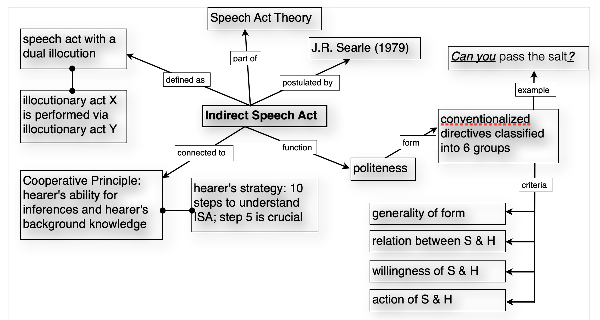

tags:: [[reading]]

- What to read for your project?
  id:: 66291f12-2fe9-4663-928f-f473a2849613
  collapsed:: true
	- start with **general introductions** giving you the broader picture
	- **narrow down** your reading to more specific articles, focussing on individual theoretical concepts
	- with each reading refine your **keyword list** to gradually cover the whole research area
	- if you're unsure about the relevance of a text, **skim**: read the abstract, table of contents or index and check for notions that seem to relate to your topic
	  collapsed:: true
		- abstract
		- figures
		- tables
		- conclusion
		- introduction
	- make sure to include the **latest publications** on your topic
	- once you get the same sources in the reference section of the texts you read over and over again and no new relevant publications can be found, your reading list has reached the **saturation point**
- How to read?
  collapsed:: true
	- Modes of reading
	  collapsed:: true
		- **scanning**
		  id:: 6476206a-e328-42f8-b979-21b21eb36b90
			- quick reading, looking for key words
			  id:: 64762078-b8c1-4ddf-afd2-35bf7a3e67ef
		- **skimming**
		  id:: 6476206a-220f-4cc7-8fc4-9111db544a3f
			- cross-reading of the whole text; identification of passages to be read more closely later on
		- **selective reading**
		  collapsed:: true
			- reading only those passages of the text relevant to your topic
			- the table of contents and/or the index can help you identify relevant passages or with an eletronic source use the search function and look for keywords
		- **close reading**
		  collapsed:: true
			- careful and critical reading of the full text
			- usually involves taking notes, highlighting, commenting etc.
			- develop a system that works for you and use it consistently
		- **creative reading**
		  collapsed:: true
			- reading with an open mind for inspiration of own ideas
		- maybe except for the last type, you should always take notes while reading
	- SQ4R method
	  collapsed:: true
		- 
		- **recite**: also **relate** the information to relevant concepts related to your topic
- reading and [[writing]]
  collapsed:: true
	- Reading with a specific topic in mind is always tightly linked to writing. For core texts it is advisable to produce an **excerpt**, so that you do not only rewrite the original text, but process the information contained in the literature, formulate it **in your own words** and adjust it to your topic.
	- First reading
	  collapsed:: true
		- get a **general picture** and an outline of the text;
		- note down the **structure** (headings, chapters, sections, paragraphs) on a piece of paper (index cards or first page of a computer file)
		- indicate **irrelevant parts** of the text
	- Second reading
	  collapsed:: true
		- **topic** of each chapter, section, paragraph
		- **summary** of each chapter, section, paragraph
		- names of important **authors/sources**, e.g. for further reading
		- note down possible **quotations** (indicate pages and page break in the quotation)
		- note down helpful **examples**, **tables**, and **figures**
		- summarize aspects that are relevant to your own work, mark potential links to your **research questions** or to chapters in your table of contents
		- make notes to yourself indicating **questions**, unclear explanations, links to other texts you've read
- highlighting and marking
  id:: 64762078-9f92-47fb-a7b1-83b8010693eb
  collapsed:: true
	- you can directly work with a photocopy or a **PDF** of the text and highlight and mark all necessary information and thus prepare a commented version.
	- you can use a system of **colours** to work out the structure of the text
	- **highlight** names of authors and researchers, definitions, examples and possible quotations in different ways
	- comment on the **margins** with keywords, paraphrases, summaries, etc.
	- **cross out** passages that are not important for your work
	- additionally, use **post-its**, for notes to yourself indicating cross-references to other texts, own ideas, and problematic passages
	- all of this works really well when using **[[Zotero]]'s PDF reader**
- visualisations
  collapsed:: true
	- 
- strategies for difficult passages
  collapsed:: true
	- cf. [[Cottrell2013StudySkills]]: p. 168f.
	  collapsed:: true
		- If you have the feeling that you don't understand what you're reading or that you cannot make sense of it, check the following issues:
			- make sure you have the necessary **theoretical background** for the text 
– if not, go back to a more general, introductory text.
			  logseq.order-list-type:: number
			  collapsed:: true
			- try to briefly **sum up** what you have read after a few sentences
			  logseq.order-list-type:: number
			  collapsed:: true
			- try to read with a **specific question** in mind in order to get an answer from the text
– if (2) or (3) do not work, re-read the passage, read it aloud
			  logseq.order-list-type:: number
			  collapsed:: true
			- **highlight** and colour-code relevant notions (see [Section on highlighting](((64762078-9f92-47fb-a7b1-83b8010693eb))))
			  logseq.order-list-type:: number
			  collapsed:: true
			- Ask questions
			  logseq.order-list-type:: number
			  collapsed:: true
				- What does the author want to show?
				- Is there a particular question behind this passage?
				- Why is the passage relevant?
				- Is it relevant for my topic?
				- What do I learn from this?
- critical evaluation
  collapsed:: true
	- [[Cottrell2013StudySkills]]: 187–196
		- find and evaluate the **line of reasoning** – is the information relevant to the topic, logical, understandable, not circular?
		- does the text have a **logical structure**?
		- are aspects **explained** before they are applied?
		- is there **evidence** to support the claims, is it appropriate and reliable, are any relevant issues missing?
		- do the **conclusions** make sense, are they clearly stated and well thought through?
		- does the **evidence** support the **conclusions**?
- [[practice]]: reading [[Ilbury2020Sassy]]
	- Ilbury, Christian. 2020. ‘“Sassy Queens”: Stylistic Orthographic Variation in Twitter and the Enregisterment of AAVE’. *Journal of Sociolinguistics* 24 (2): 245–64. [https://doi.org/10.1111/josl.12366](https://doi.org/10.1111/josl.12366).
	  collapsed:: true
		- {{video https://www.youtube.com/watch?v=ydmPh4MXT3g&pp=ygUeYWluJ3Qgbm9ib2R5IGdvdCB0aW1lIGZvciB0aGF0}}
	- Skimming and Scanning Questions
	  collapsed:: true
		- How many tweets in the study contain AAVE features?
		  logseq.order-list-type:: number
		  collapsed:: true
			- 307 tweets.
			- Source: Page 252, "Of the 15,804 tweets extracted from the 10 users, 307 (1.9%) individual tweets contain AAVE features."
		- Which user had the highest frequency of AAVE feature usage and what was the percentage?
		  logseq.order-list-type:: number
		  collapsed:: true
			- User 4, with 6.8% of his tweets containing at least one AAVE feature.
			- Source: Page 252, "User 4 dominates, using at least one AAVE feature in 6.8% (n=133) of his 1,958 tweets."
		- What are the four most common lexical AAVE features found in the tweets?
		  logseq.order-list-type:: number
		  collapsed:: true
			- "Y’all," "Yaas," "Basic," and "Thirsty."
			- Source: Table 3 on Page 253.
		- Identify two reasons why White southern British users were selected for the study.
		  logseq.order-list-type:: number
		  collapsed:: true
			- 1. To maximize the distance between the style analyzed (AAVE) and the user's assumed habitual dialect (Southern British English).
			- 2. The well-established use of stylized features of AAVE in spoken interactions among members of certain subcultures of the gay community.
			- Source: Page 250, "First, White southern British users were selected to maximize the distance between the style analysed here (AAVE) and the user's assumed habitual dialect (SBE)...Second, the tweets of gay men were examined because of the well-established use of stylized features of AAVE in spoken interactions amongst members of certain subcultures of the gay community."
		- What is the total number of tweets analyzed in the study?
		  logseq.order-list-type:: number
		  collapsed:: true
			- 15,804 tweets.
			- Source: Page 250, "The final corpus comprises 15,804 tweets."
		- Which phonological feature of AAVE had the highest frequency in the dataset?
		  logseq.order-list-type:: number
		  collapsed:: true
			- The orthographic representation of (ING) as in <in> for <ing>.
			- Source: Table 4 on Page 254.
		- What percentage of tweets containing AAVE features were directed at other users?
		  logseq.order-list-type:: number
		  collapsed:: true
			- 60.9% of tweets containing AAVE features were directed.
			- Source: Page 256, "Of the 187 tweets that are both directed and contain AAVE features, 90.9% (n=170) of those tweets are to other gay male users."
	- Comprehension Questions
	  collapsed:: true
		- What is the primary research question of the study?
		  logseq.order-list-type:: number
		  collapsed:: true
			- The study explores how orthographic variations of African American Vernacular English (AAVE) on Twitter are used to deploy personae, specifically examining the "Sassy Queen" persona among gay British men.
			- Source: Abstract on Page 245.
		- What methodology does Ilbury use to collect and analyze data?
		  logseq.order-list-type:: number
		  collapsed:: true
			- Ilbury extracts a corpus of 15,804 tweets from the timelines of 10 gay British men using Twitter's API. The tweets are manually coded for instances of AAVE features, and the context of these features is analyzed.
			- Source: Method section on Page 250.
		- List three features of AAVE identified in the tweets and provide examples from the study.
		  logseq.order-list-type:: number
		  collapsed:: true
			- 1. Lexical Features: Example - "Y’all haters corny."
			- 2. Phonological Features: Example - "Feeling pumped for another night in the big city working dat podium!"
			- 3. Morphosyntactic Features: Example - "Filters be a gay’s best friend."
			- Source: Pages 252-255 and Tables 3-6.
	- Critical Thinking Questions
	  collapsed:: true
		- Discuss the ethical implications of using AAVE features by non-AAVE speakers on social media.
		  logseq.order-list-type:: number
		  collapsed:: true
			- Consider cultural appropriation and the reinforcement of stereotypes.
			- Source: This requires interpretation based on the discussion throughout the paper.
		- Evaluate the strengths and limitations of the methodology used in this study.
		  logseq.order-list-type:: number
		  collapsed:: true
			- Strengths could include the detailed qualitative analysis; limitations might involve the small sample size and potential biases in manual coding.
			- Source: This requires critical evaluation based on the methods described on Pages 250-251.