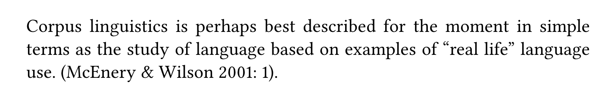
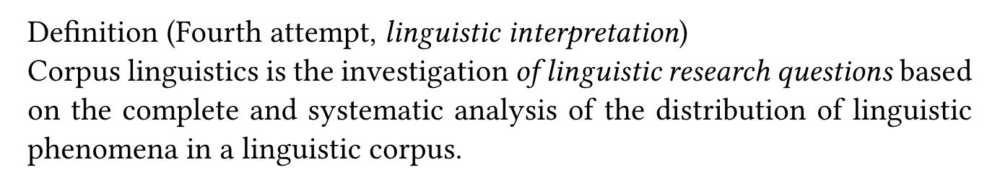
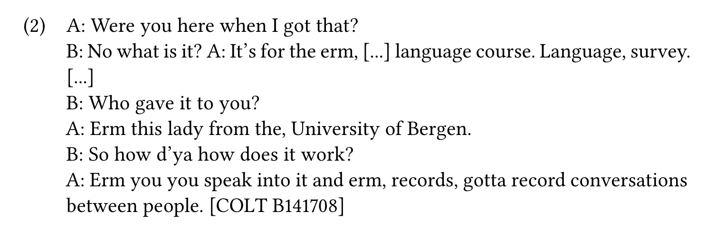

- [[Stefanowitsch2020Corpus]]
  collapsed:: true
	- ((6660528c-06dc-4737-a304-1930af1e4e71))
	- What is corpus linguistics?
		- {:height 74, :width 572}
		  (p. 22)
		- {:height 96, :width 580}
		  (p. 55)
	- What is a corpus?
		- definition (p. 22–23)
			- In corpus linguistics, the term is used differently – it refers to a collection of samples of language use with the following properties:
				- the instances of language use contained in it are **authentic**
				- the collection is **representative** of the language or language variety under investigation;
				- the collection is **large**.
		- authenticity
		  collapsed:: true
			- {:height 195, :width 584}
			  (p. 26)
		- representativeness
		  collapsed:: true
			- definition
			  collapsed:: true
				- “Put simply, a representative sample is a subset of a population that is identical to the population as a whole with respect to the distribution of the phenomenon under investigation. Thus, for a corpus (a sample of language use) to be representative of a particular language, the distribution of linguistic phenomena (words, grammatical structures, etc.) would have to be identical to their distribution in the language as a whole (or in the variety under investigation, see further below).” (p. 28)
			- language varieties
				- “In this book, I use language variety to refer to any form of language delineable from other forms along cultural, linguistic or demographic criteria. In other words, I use it as a superordinate term for text-linguistic terms like genre, register, style, and medium as well as sociolinguistic terms like dialect, sociolect, etc.
				- dimensions
					- [[genre]]
					  collapsed:: true
						- culturally defined and recognized varieties,
					- [[register]]
					  collapsed:: true
						- varieties characterized by a particular “functional configuration” (roughly, a bundle of linguistic features associated with a particular social function),
					- [[style]]
					  collapsed:: true
						- degrees of formality (e.g. formal, informal, colloquial, humorous, etc.)
					- [[medium]]
					  collapsed:: true
						- material manifestation (essentially, spoken and written with subtypes of these).
					- [[topic]]
					  collapsed:: true
						- content of texts or the discourse domain from which they come
					- [[text category]]
					  collapsed:: true
						- “When a particular variety, defined by one or more of the dimensions just mentioned, is included in a given corpus, I refer to it as a text category of that corpus.” (Stefanowitsch, 2020, p. 29)
		- size
		  collapsed:: true
			- “There is no **principled answer** to the question “How large must a linguistic corpus be?”, except, perhaps, an honest “It is impossible to say” (Renouf 1987: 130). However, there are **two practical answers**.
				- The **more modest answer** is that it must be large enough to contain a sample of instances of the **phenomenon under investigation** that is large enough for analysis (we will discuss what this means in Chapters 5 and 6).
				- The **less modest answer** is that it must be large enough to contain sufficiently large samples of **every grammatical structure, vocabulary item, etc.** Given that an ever increasing number of texts from a broad range of language varieties is becoming accessible via the web, the second answer may not actually be as immodest as it sounds.
			- Current corpora that at least make an honest attempt at diversity currently range
				- from one million (e.g. the ICE corpora mentioned above)
				- to about half a billion (e.g. the COCA mentioned in the preceding chapter).
			- Looking at the published corpus-linguistic literature, my impression is that for most linguistic phenomena that researchers are likely to want to investigate, these corpus sizes seem sufficient. Let us take this broad range as characterizing a linguistic corpus for practical purposes.” (Stefanowitsch, 2020, p. 38)
- fundamentals
  collapsed:: true
	- What is corpus linguistics about?
		- Corpus linguistics is a research methodology within the field of linguistics that focuses on the systematic study of language using large and diverse **collections of authentic texts**, known as [[corpora]].
		- These collections of language data, either written or spoken, provide a comprehensive and [empirical basis]([[empirical data]]) for the analysis of
		  collapsed:: true
			- language use (e.g. collocational patterns such as _pretty woman_)
			- [[linguistic variation]] across different text types or communities (e.g. neologisms such as _smash_)
			- [[language change]] (e.g. _going to_ future)
		- The primary goal of corpus linguistics is to investigate linguistic phenomena and patterns by examining [real-world language usage]([[empirical data]]).
		- This approach contrasts with more traditional linguistic methods that rely heavily on introspection and theoretical speculation (e.g. Chomsky).
		  collapsed:: true
			- poverty of the stimulus argument
		- Corpus linguistics has gained significant momentum in recent years, thanks to advances
		  collapsed:: true
			- in [[data]] (e.g. [[web corpora]] and [[social media]] corpora (e.g. [[Twitter]] and [[Reddit]])
			- and [[methods]] (e.g. [social network analysis]([[social network analysis]]), [machine learning]([[machine learning]])).
	- What is corpus linguistics good for?
		- Corpus linguistics as a [[usage-based approach]] to linguistic analysis
			- Corpus linguistics is highly valuable from a usage-based approach to linguistics, as it emphasizes the importance of **actual language use** in shaping linguistic knowledge and structure.
			- The usage-based perspective posits that **linguistic structure and knowledge emerge from the patterns** and regularities that speakers encounter in their experience with language.
			- In this context, corpus linguistics provides a powerful toolset for investigating these patterns and regularities, offering several advantages:
			  collapsed:: true
				- **Authentic language data**: Corpus linguistics relies on large and diverse collections of authentic texts, which represent real-world language use. This ensures that the patterns and structures uncovered through corpus analysis are grounded in genuine linguistic behavior, rather than relying on idealized or artificial examples.
				- [[quantitative approach]]: Corpus linguistics allows for the quantitative analysis of linguistic phenomena, such as  [frequency counts]([[frequency]]) and [statistical measures]([[statistics]]). This enables researchers to identify and describe patterns and regularities that emerge from language use, supporting the usage-based claim that linguistic structure is shaped by frequency and distributional patterns in the input.
				- [Collocations]([[collocations]]) and [[constructions]]: The usage-based approach posits that language is composed of form-meaning pairings, known as constructions, which range from morphemes and words to idiomatic expressions and complex syntactic structures. Corpus linguistics offers tools for identifying and analyzing collocations and constructions in large datasets, contributing to our understanding of the relationships between form, meaning, and use.
				  				id:: f67743f8-3c70-475b-993b-1f2eb4bc9a2f
				  collapsed:: true
				- [Variability]([[linguistic variation]]) and context sensitivity: Corpus linguistics enables the examination of language use across different contexts, genres, and [registers]([[register]]). This allows researchers to investigate how linguistic features and structures vary and adapt to different situations, providing insights into the dynamic nature of language and its sensitivity to context, which is a key aspect of the usage-based approach.
				- [Language change]([[language change]]) and development: Corpus linguistics can be applied to [diachronic]([[diachronic]]) and [synchronic]([[synchronic]]) data, allowing researchers to track language change over time and compare different stages of language development. This helps to shed light on the emergence and evolution of linguistic structures, which is of particular interest to [usage-based theorists]([[usage-based approach]]) who seek to explain language change as a result of cumulative changes in usage patterns.
				- Data-driven [language teaching]([[language teaching]]) and [learning]([[language learning]]): The usage-based approach emphasizes the importance of [[exposure]] to authentic [[language input]] in the acquisition process. Corpus linguistics can inform the development of language teaching materials and methods, by providing insights into the most [frequent]([[frequency]]) and relevant structures, vocabulary, and collocations that learners need to acquire.
	- key concepts
	  id:: 643e61f8-cf0b-4b40-b162-8132663181d8
		- [[corpus]]
		  collapsed:: true
			- A corpus is a large, structured collection of texts that serves as the basis for linguistic analysis. Corpora can be general, representing a wide variety of language use, or specialized, focusing on specific genres, registers, or domains.
		- [[annotation]]
		  collapsed:: true
			- Annotation refers to the process of adding metadata or linguistic information to a corpus, such as part-of-speech tags, syntactic structure, or semantic roles. This additional information can facilitate more in-depth and accurate analyses.
			- [[metadata]]: data **about** language use on several levels:
				- corpus
					- texts: [[author]], [[text type]], [[register]], [[topic]]
						- [running words (tokens)]([[tokens]]): [[word class]], [[lemmatization]]
		- [[concordance]]
		  id:: 648033b8-e219-444d-83dd-04c79b44530c
			- A concordance is a tool that allows researchers to search for specific words, phrases, or patterns in a corpus and display the results in context. This helps researchers to examine language patterns and identify trends across various texts.
		- [[collocations]]
		  id:: 648033b8-7985-4fca-b09e-e5f18cfe1862
			- Collocation refers to the co-occurrence of words within a specific context or proximity. Studying collocations can reveal important information about word usage, meaning, and associations.
			  id:: 643e7a15-ed51-442c-876c-b0e501e8a7c1
		- [[frequency]]
		  collapsed:: true
			- Frequency analysis involves counting the occurrences of linguistic features, such as words or structures, within a corpus. This helps researchers identify patterns and trends, as well as compare language use across different corpora.
		- [[n-grams]]
		  collapsed:: true
			- N-grams are sequences of n contiguous words or linguistic units within a text. They can be used to study word combinations, patterns, and structures in a corpus.
				- Example: *The cat sat on the mat.*
				- Example corpus: [[Google N-grams]]
		- [[register]]
		  collapsed:: true
			- Register refers to the language variety used in specific contexts or situations, characterized by particular linguistic features, such as vocabulary, grammar, and style. Examining registers can help researchers understand language variation and adaptation.
			  collapsed:: true
				- a type of [[text type/variation]]
	- corpuslinguistic platforms
		- [[Sketch Engine]]
		- [[english-corpora.org]]
		- [CQP Web](https://cqpweb.lancs.ac.uk/)
		  collapsed:: true
			- for [[BNC]] and other corpora
		- …
- Sketch Engine
	- {{embed [[Sketch Engine]]}}