- assessment
	- {{embed ((662a5c90-7e5e-4248-a258-580789c780aa))}}
- using [[english-corpora.org]]
	- website: https://www.english-corpora.org/
	- documentation
	  collapsed:: true
		- 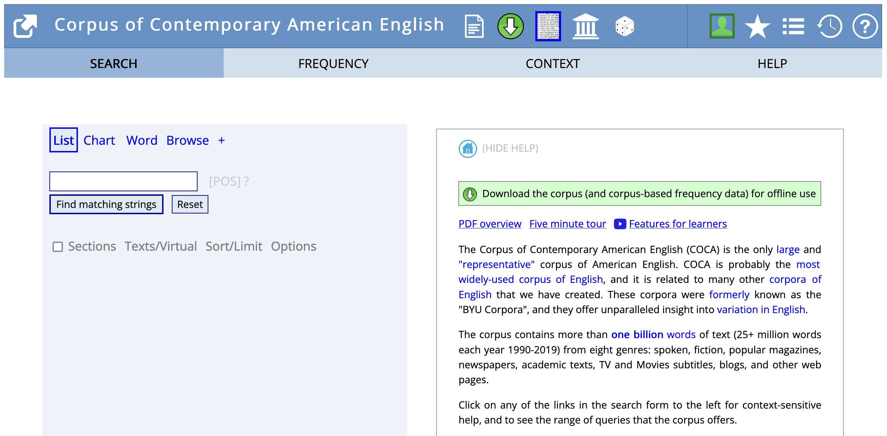
		- 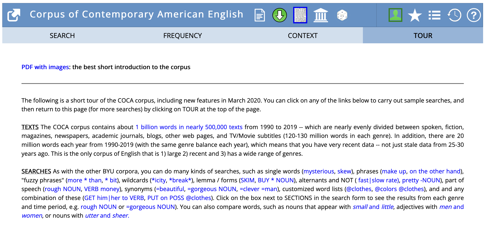
	- available [[corpora]]
	  id:: 648967e3-a1bb-43dc-957b-4e95eb21822b
	  collapsed:: true
		- 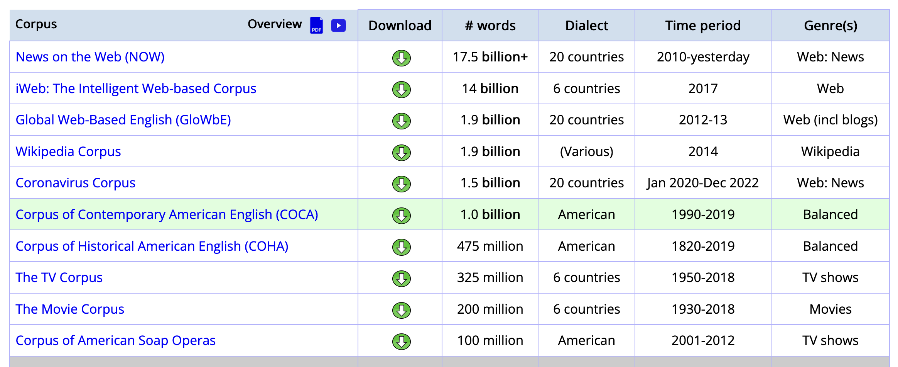
	- use cases
	  id:: 64896809-e84c-4885-bf8f-f1b73181834f
		- diachronic: the use of *phone* over time
		  collapsed:: true
			- [[COHA]]
			  collapsed:: true
				- 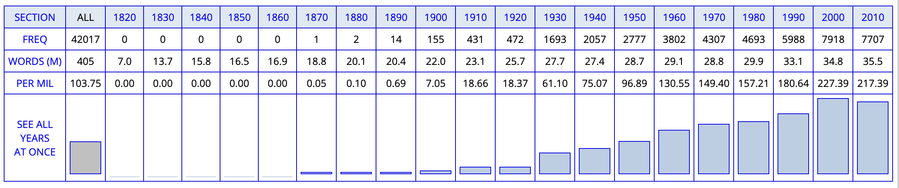
			- [[COCA]]
			  collapsed:: true
				- 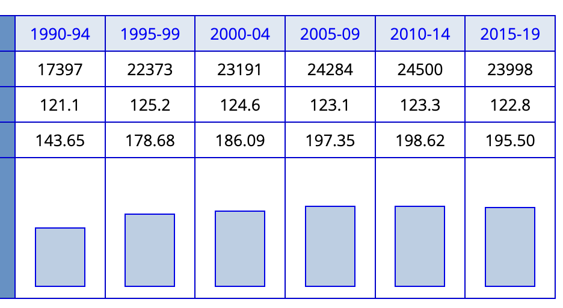{:height 177, :width 306}
			- [[NOW Corpus]]
			  collapsed:: true
				- 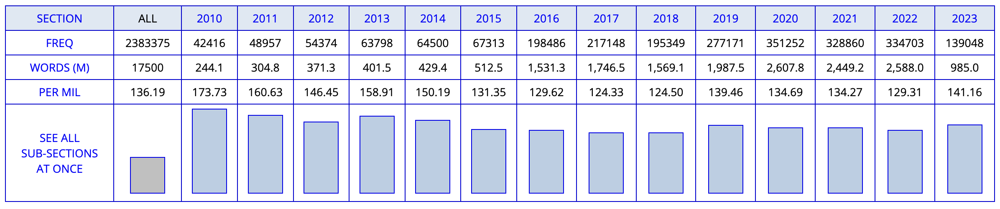
		- text types: the use of *smartphone* across text types
		  collapsed:: true
			- [[COCA]]
				- 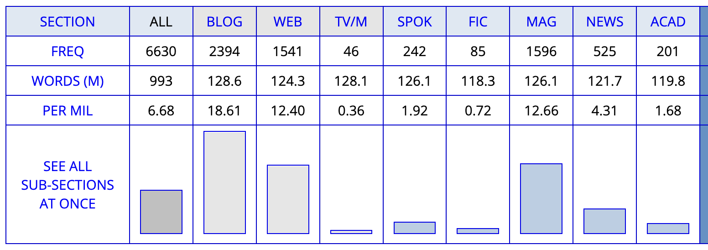{:height 229, :width 548}
				- 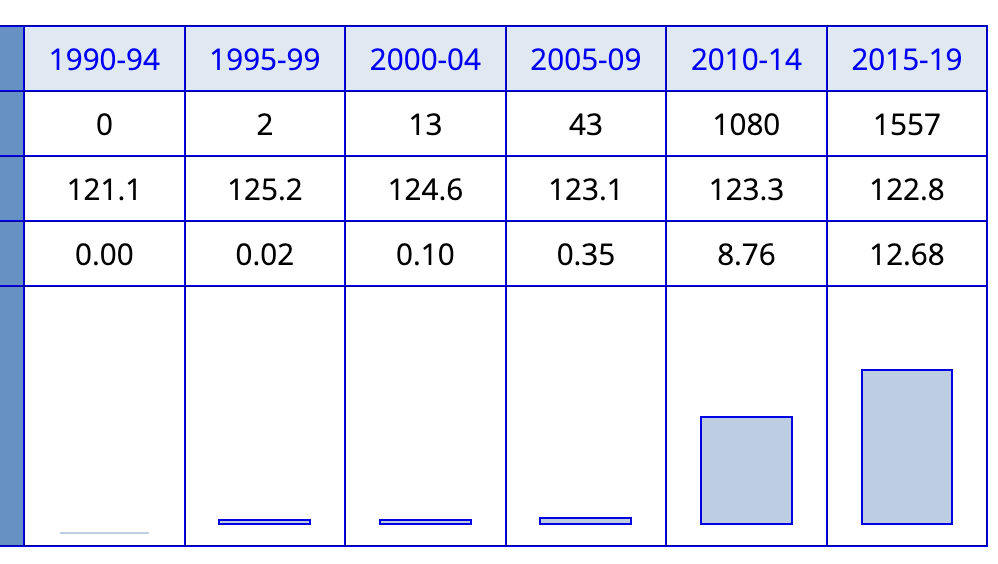{:height 210, :width 365}
		- regional variation: the use of *autumn* and *fall*
		  collapsed:: true
			- [[NOW Corpus]]
			  collapsed:: true
				- *autumn*
				  collapsed:: true
					- 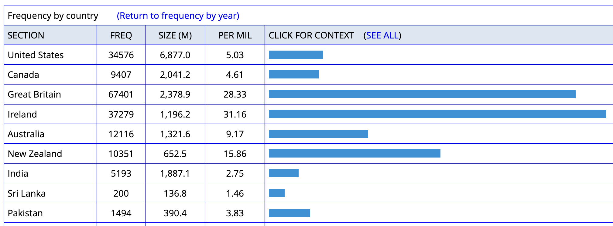
				- *fall*
				  collapsed:: true
					- 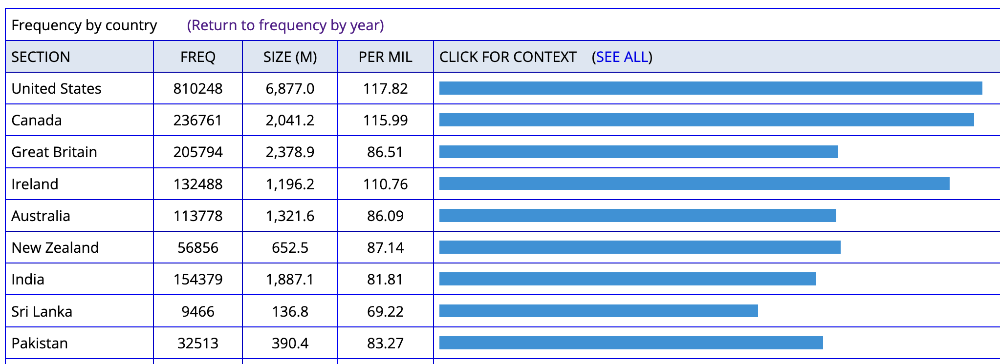
	- [[practice]]
		- Find two words that exhibit significant frequency changes in the 20th century.
		  collapsed:: true
			- one that has *increased* in frequency
			- one that has *decreased* in frequency
		- Find two words whose use differs significantly between text types.
		  collapsed:: true
			- one that is used more often in *formal* text types
			- one that is used more often in *informal* text types
		- Find a word whose use differs significantly between two countries (e.g. BrE vs AmE).
- compiling your own corpora
	- theory
	  collapsed:: true
		- principles of building corpora ([[Knight2022Building]])
		  collapsed:: true
			- The contents of a corpus should be selected without regard to the language they contain, but according to their **communicative function** in the community in which they arise.
			  logseq.order-list-type:: number
			- Corpus builders should strive to make their corpus as **representative** as possible of the language from which it is chosen.
			  logseq.order-list-type:: number
			- Only those components of corpora which have been designed to be **independently contrastive** should be contrasted.
			  logseq.order-list-type:: number
			- Criteria for determining the structure of a corpus should be small in number, clearly separate from each other and efficient as a group in **delineating a corpus** that is representative of the language or variety under examination.
			  logseq.order-list-type:: number
			- Any information about a text other than the alphanumeric string of its words and punctuation should be stored separately from the **plain text** and merged when required in applications.
			  logseq.order-list-type:: number
			- Samples of language for a corpus should, wherever possible, consist of **entire documents** or transcriptions of complete speech events, or should get as close to this target as possible. This means that samples will differ substantially in size.
			  logseq.order-list-type:: number
			- The design and composition of a corpus should be **documented** fully with information about the contents and arguments in justification of the decisions taken.
			  logseq.order-list-type:: number
			- The corpus builder should retain as target notions **representativeness and balance**. While these are not precisely definable and attainable goals, they must be used to guide the design of a corpus and the selection of its components.
			  logseq.order-list-type:: number
			- Any control of subject matter in a corpus should be imposed by the use of **external**, not internal, **criteria**.
			  logseq.order-list-type:: number
			- A corpus should aim for **homogeneity** in its components while maintaining adequate **coverage**, and rogue texts should be avoided.
			  logseq.order-list-type:: number
		- creating specialised corpora ([[Koester2022Building]])
		  collapsed:: true
			- **Specific purpose** for compilation, e.g. to investigate a particular grammatical or lexical item;
			- **Contextualisation**: particular setting, participants and communicative purpose;
			- **Genre**, e.g. promotional (grant proposals, sales letters);
			- Type of **text/discourse**, e.g. biology textbooks, casual conversation;
			- **Subject matter/topic**, e.g. economics;
			- **Variety** of English, e.g. Learner English.
	- [[practice]]: using [[Sketch Engine]] to compile corpora
		- from documents: [[Gutenberg Project]] corpus
		  collapsed:: true
			- example sources
			  collapsed:: true
				- Charles Dickens
					- Novels
						- "Great Expectations" (1861)
						  collapsed:: true
							- This novel tells the story of Pip, an orphan boy who is adopted by a blacksmith's family. Pip is provided with a mysterious inheritance from an unknown benefactor, which leads him to abandon his lowly origins in the hope of becoming a gentleman.
						- "Oliver Twist" (1838)
						  collapsed:: true
							- This is a tale about an orphan, Oliver, who runs away from a workhouse and meets a group of boys trained to be pickpockets by an elderly mentor. The novel explores themes of child labor, treatment of orphans, and the inequities of the criminal justice system of Dickens' time.
					- Short Stories
						- "A Christmas Carol" (1843)
						  collapsed:: true
							- This is a story about Ebenezer Scrooge, a miserly old man who is visited by the ghost of his former business partner Jacob Marley and the Ghosts of Christmas Past, Present, and Yet to Come. After their visits, Scrooge is transformed into a kinder, gentler man.
						- "The Chimes" (1844)
						  collapsed:: true
							- This is a story of a poor porter, Toby Veck, who receives a vision of the future that shows the devastating consequences of his loss of faith in society. The vision is brought about by the chimes of a church bell.
				- Mark Twain
					- Novels
						- "The Adventures of Tom Sawyer" (1876)
						  collapsed:: true
							- This novel is about a young boy named Tom Sawyer who lives along the Mississippi River. The story is a classic portrayal of a boy's adventures in the mid-nineteenth century, including his escapades at school, his engagement in various pranks, and his running away to become a pirate.
						- "Adventures of Huckleberry Finn" (1884)
						  collapsed:: true
							- This is a direct sequel to "The Adventures of Tom Sawyer". The novel follows Huck Finn and a runaway slave named Jim as they travel down the Mississippi River on a raft, exploring themes of freedom, friendship, and the often hypocritical societal norms.
					- Short Stories
						- "The Man That Corrupted Hadleyburg" (1899)
						  collapsed:: true
							- This is a piece of short fiction about the residents of Hadleyburg, who are known for their honest reputation, but when a stranger passes through town, he leaves a plan to reveal their deceitful side.
						- "The Facts Concerning the Recent Carnival of Crime in Connecticut" (1876)
						  collapsed:: true
							- "The Facts Concerning the Recent Carnival of Crime in Connecticut" is a short story by Mark Twain. Unfortunately, I couldn't find a detailed summary or the publication year on Wikipedia. However, the story is known for its satirical take on morality. It features the protagonist's encounter with his own conscience, personified as a loathsome creature. The protagonist realizes that by listening to his conscience, he has been led to live a life of excessive guilt and moral restriction. In a twist of events, he manages to eliminate his conscience, leading to a series of immoral acts that he carries out with impunity.
			- download books from [[Gutenberg Project]]
			  collapsed:: true
				- https://www.gutenberg.org/ebooks/
				- 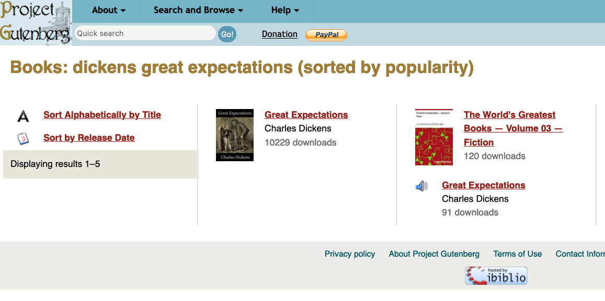
				- 
				- 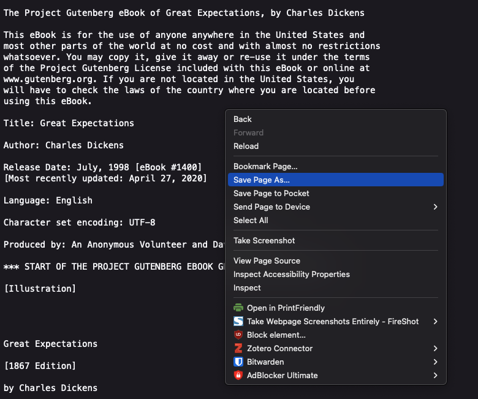
				- file organisation
				  collapsed:: true
					- create a new folder and put all the files there
					- use descriptive file names: e.g. `1860_dickens_great-expectations.txt`
					- sidenote: `2024-05-24_paper.docx`
			- create corpus in [[Sketch Engine]]
			  collapsed:: true
				- initialise corpus
				  collapsed:: true
					- 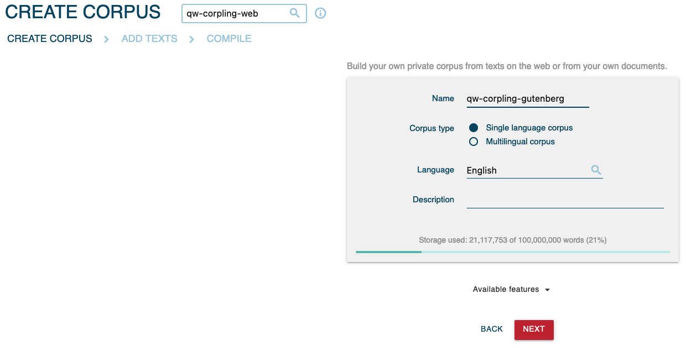
				- upload files
				  collapsed:: true
					- 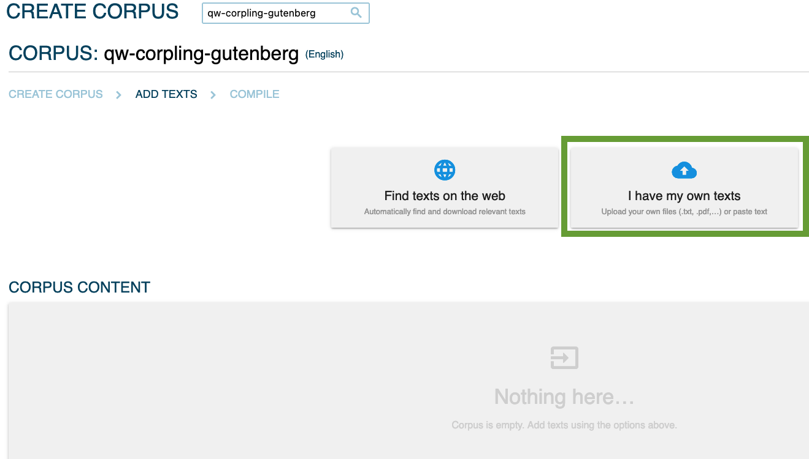
				- edit metadata
				  collapsed:: true
					- 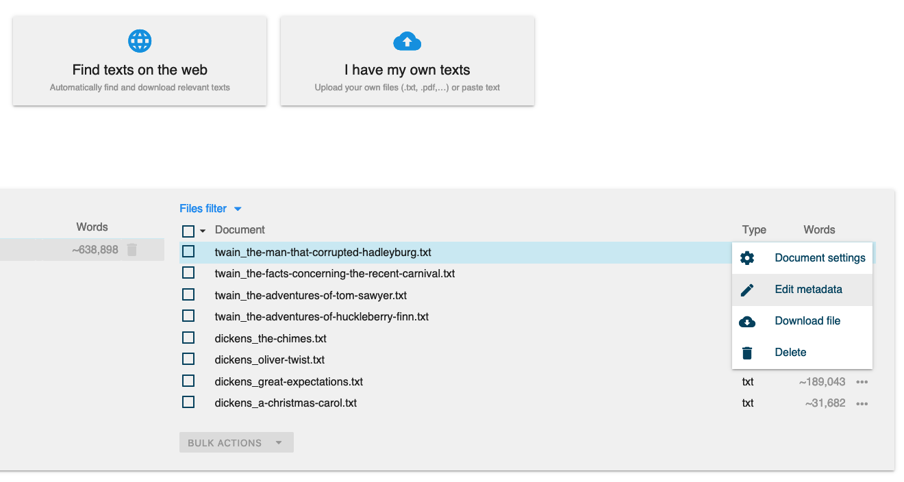
					- 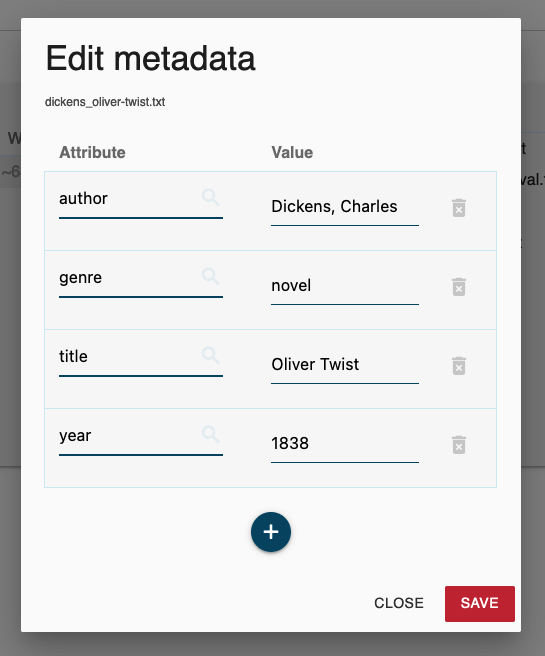
					  collapsed:: true
						- note that you can and should use bulk editing
				- compile your corpus
			- corpus information
			  collapsed:: true
				- overview
				  collapsed:: true
					- 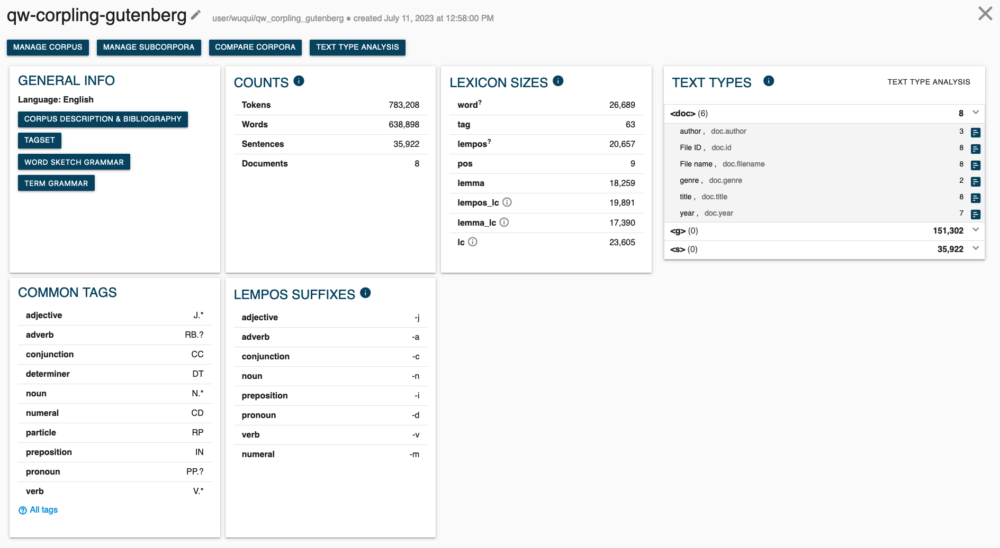
				- text type distributions
				  collapsed:: true
					- 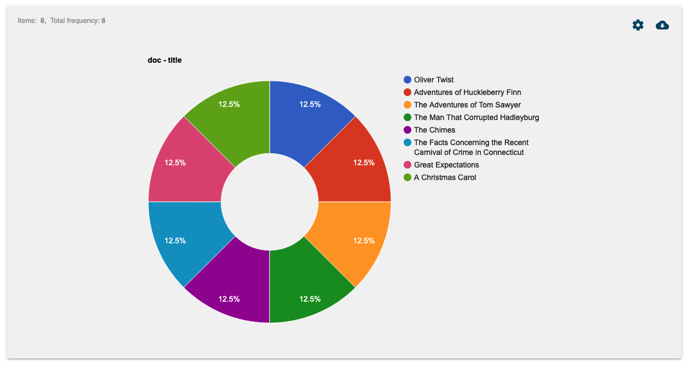
			- keyword analysis
			  collapsed:: true
				- 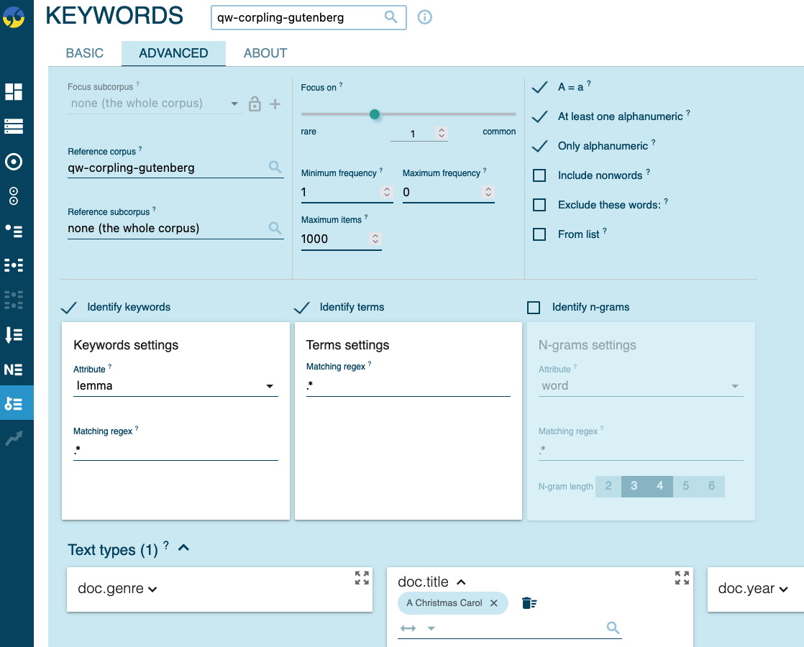
				- 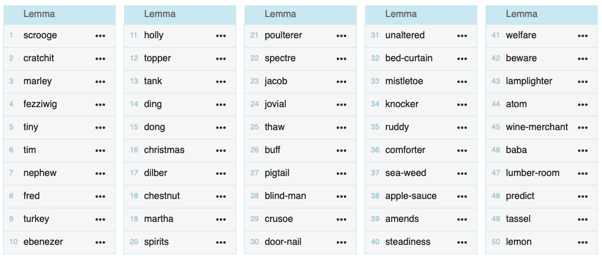
			- sharing corpora
			  collapsed:: true
				- this example corpus is shared with all LMU users
				- you should find it under its name `qw-corpling-gutenberg`
				- you should be able to add files and edit metadata
		- from the web
		  collapsed:: true
			- [Sketch Engine documentation](https://www.sketchengine.eu/guide/create-a-corpus-from-the-web/)
			  collapsed:: true
				- settings
				  collapsed:: true
					- default settings
					  collapsed:: true
						- collapsed:: true
						  > As a rule of thumb, do not worry about the advanced settings and use 
						  the default settings. Only if the results do not produce the desired 
						  results, start looking into the advanced settings.
					- multi-word search terms
					  collapsed:: true
						- > Please note that you can use multiwords such as “kick the bucket” using the quotes, and also proper names of different kinds.
					- denylist
					  collapsed:: true
						- > Denylist keywords can also be used to reduce ambiguity (e.g. you might use “politics” when collecting a corpus on the environment using “party”). It is only necessary to use the denylist and allowlist if you irrelevant documents are found, otherwise it is not necessary.
					- searching for specific varieties
					  collapsed:: true
						- > Limit the search to only UK domains or the domains of Portugal. Type .uk (.pt) into the site list in the advanced options.
				- making your corpus bigger
				  collapsed:: true
					- > You can repeat the same procedure several times to enlarge the corpus. Sketch Engine will make sure no page, is included twice.
			- initialise the corpus
			  collapsed:: true
				- use your initials as a name prefix: e.g. `qw`
				- 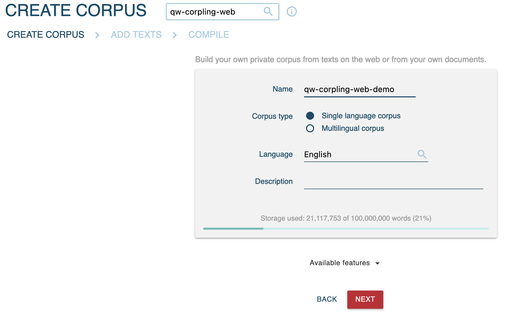
				  collapsed:: true
			- `Find texts on the web`
			  collapsed:: true
				- 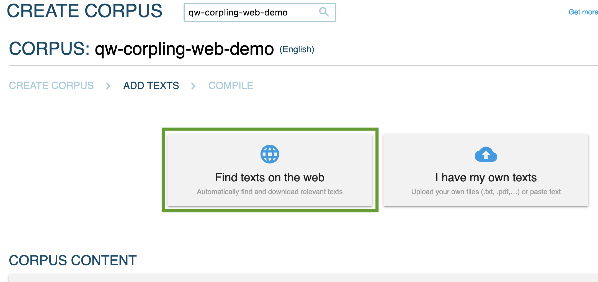
			- specify input criteria
			  collapsed:: true
				- 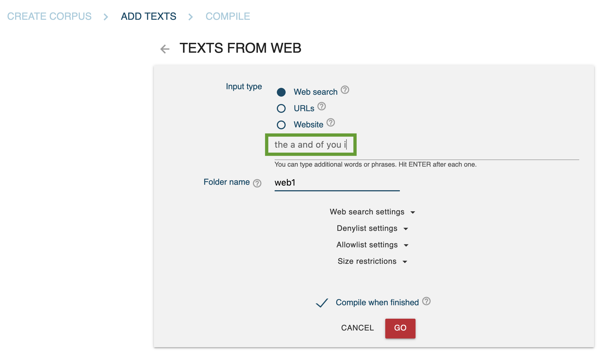
				  collapsed:: true
					- for example using keywords: `the a and of you i` → neutral corpus
					- remaining options: see [here](((64ad1ab6-c075-43b4-97ce-69e469244f39)))
			- compile corpus
			- check corpus information
			  collapsed:: true
				- overview
				  collapsed:: true
					- 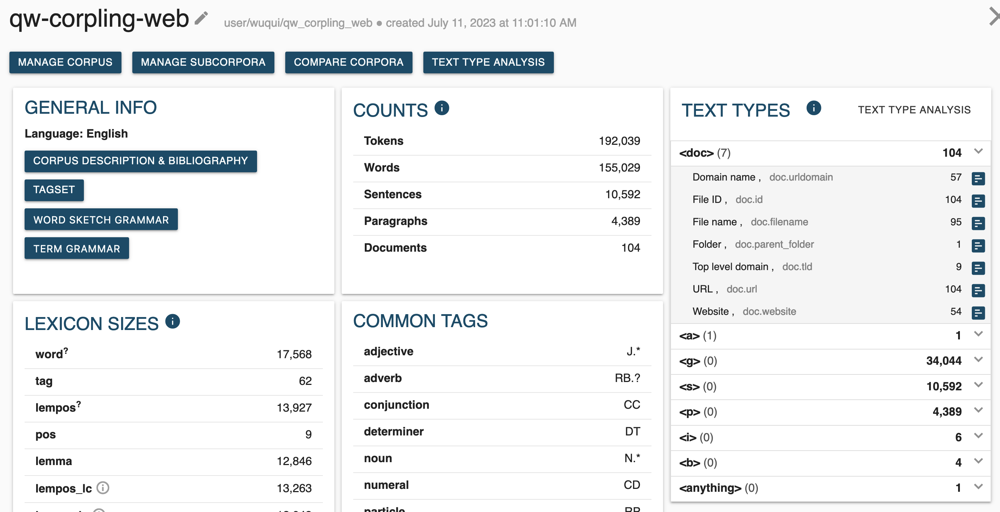
				- text type distributions
				  collapsed:: true
					- 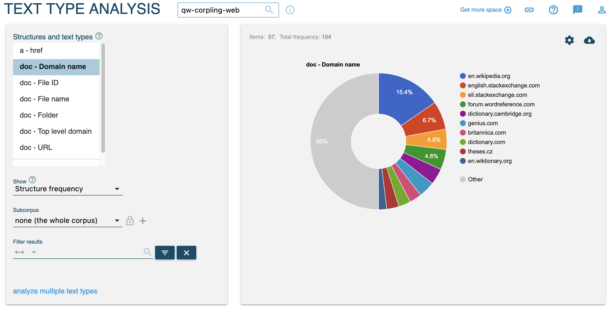
			- check keywords
			  collapsed:: true
				- 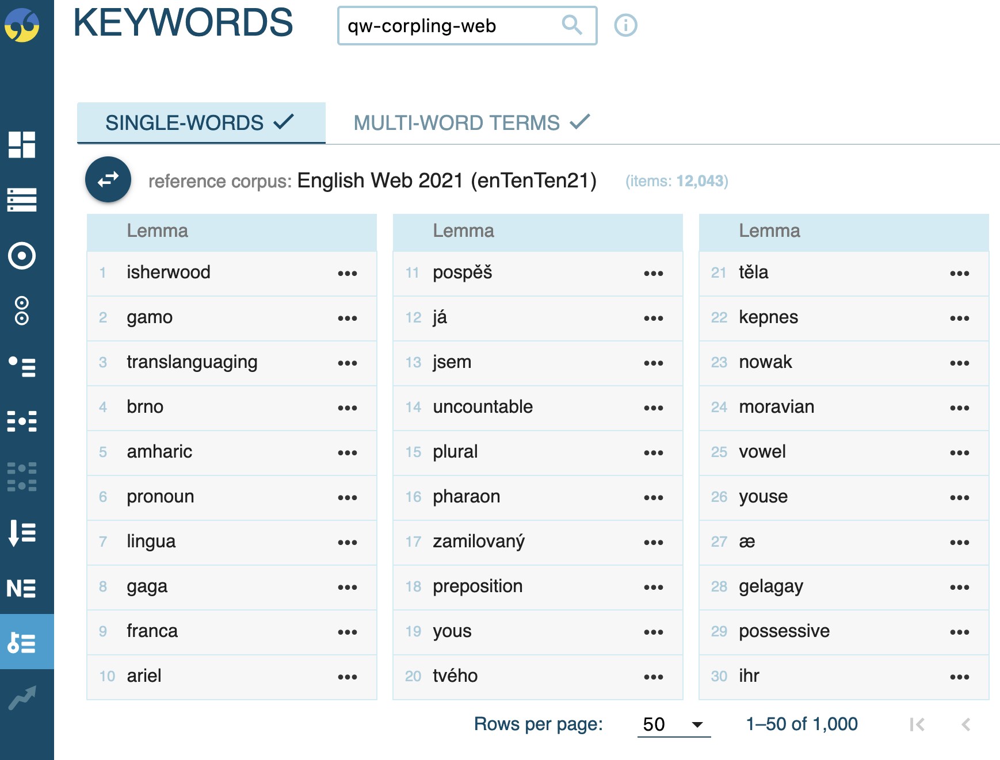
		- from [[YouTube]]
			- example file
			  collapsed:: true
				- {{video https://www.youtube.com/watch?v=E3U6MsdBalg}}
			- convert and download YouTube video as audio file (e.g. `mp3`)
				- using, e.g.: [Open Video Downloader](https://github.com/StefanLobbenmeier/youtube-dl-gui)
			- transcribe audio file using Whisper
				- using, e.g.: https://huggingface.co/spaces/Xenova/whisper-web
				  id:: 953a2e59-05a3-4dd9-9aab-149c8d4632b8
			- create corpus
			  collapsed:: true
				- upload your `txt` file(s)
			- browse and analyse your transcripts
			  collapsed:: true
				- 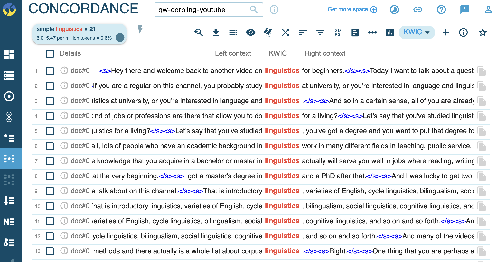