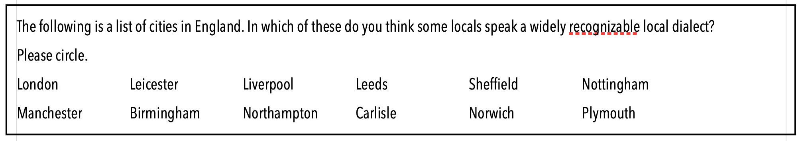
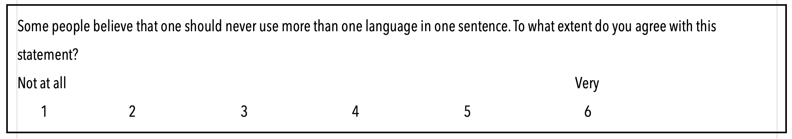
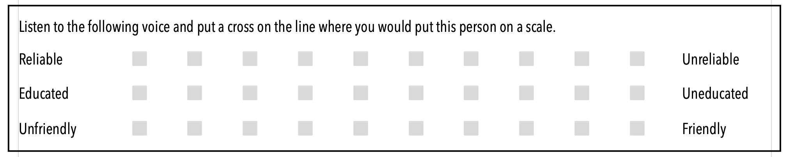
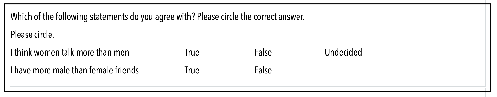
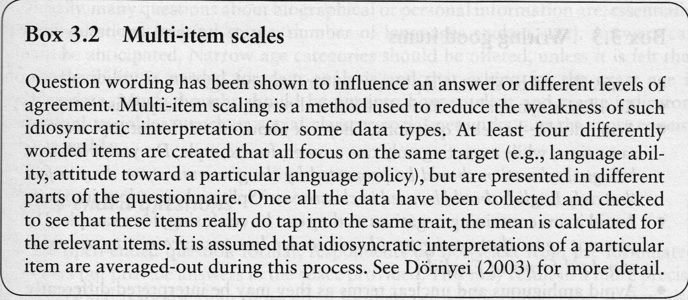

- [[questionnaires]]
	- further reading
	  collapsed:: true
		- ((66291f0f-9422-42f4-976f-789c531f9942))
	- structure of a questionnaire
	  collapsed:: true
		- questionnaire item
			- instructions
			- question/statement
			- possible answers
	- question types
	  id:: 64929eaa-570c-4600-ad1e-6eab1e9b50c6
		- open questions
		- closed questions (standardized surveys)
			- with checklists or rankings
				- 
			- with rating scales
				- 
					- Likert Scale
			- with semantic differentials
				- 
			- with true-false questions
				- 
			- with multiple-choice questions
				- {:height 169, :width 659}
	- scales
	  collapsed:: true
		- {:height 460, :width 719}
		- examples
		  collapsed:: true
			- **nominal** scale: names
			- **ordinal** scale: medals in a race
			- **interval** scale: weight + backback
			- **rational** scale: weight, age
	- design recommendations
	  collapsed:: true
		- multi-item scales
		  collapsed:: true
			- 
		- writing good items
		  collapsed:: true
			- 
				- Most research is done based on WEIRD people.
				  collapsed:: true
					- Western
					- Educated
					- Industrialized
					- Rich
					- Democratic
	- methods for analysis
	  collapsed:: true
		- microlinguistic studies vs. macrolinguistic studies
		  collapsed:: true
			- **Microlinguistics**, focuses on the small-scale or micro aspects of language.
			  collapsed:: true
				- This branch of linguistics is concerned with the **details of language structure** and use at the level of sounds (phonetics and phonology), words (morphology), sentences (syntax), and meaning (semantics). Microlinguistics also includes the study of pragmatics, which examines how context influences the interpretation of meaning.
				- The primary focus of microlinguistics is on the **individual speaker** and the **intricacies** of the language itself.
			- **Macrolinguistics**, on the other hand, is a term used to refer to the study of language in a broader or macro context.
			  collapsed:: true
				- This branch of linguistics looks at language in relation to other **sociocultural phenomena**.
				- It includes fields such as
				  collapsed:: true
					- **sociolinguistics** (how language varies and changes in social groups),
					- **psycholinguistics** (how language is processed in the mind),
					- **neurolinguistics** (how language is processed in the brain),
					- **anthropological linguistics** (how language reflects culture).
				- Macrolinguistics also involves the study of **language policy**, **language planning**, and other language-related issues at the societal or institutional level.
		- cross-sectional vs. longitudinal studies
		- pseudo-longitudinal
		  collapsed:: true
			- i.e. repeated cross-sectional studies: survey a representative sample of the target community in 2023, then another representative sample in 2025, and so on → not following the same individuals
		- quantitative approach (Labovian paradigm, Trudgill)
		- social networks approach (Milroy)
		- qualitative approach
	- crowd-sourcing
	  collapsed:: true
		- e.g. Amazon Mechanical Turk
	- tools
	  collapsed:: true
		- https://docs.google.com/forms/u/0/
		  collapsed:: true
			- Google Survey
		- http://www.socisurvey.de
		  collapsed:: true
			- available via your campus login
		- http://www.freeonlinesurveys.com
		- http://www.surveymonkey.com
		  collapsed:: true
			- Basic allows up to 10 questions
		- http://www.KwikSurveys.com
		  collapsed:: true
			- Individiual allows up ot 100 answers per survey
		- https://www.phonic.ai
		  collapsed:: true
			- available as a free trial with restricted tools, allows audio and video
- [[interviews]]
	- preparation
	  collapsed:: true
		- Before conducting the interview, it's important to have a clear understanding of the **research objectives**. This will guide the development of the interview questions.
		- It's also important to familiarize yourself with the interviewee's **background**, if possible, to tailor the questions accordingly.
	- building rapport
	  collapsed:: true
		- At the beginning of the interview, spend some time building **rapport** with the interviewee. This can help them feel more comfortable and open during the interview.
	- open-ended questions
	  collapsed:: true
		- Use **open-ended** questions to encourage the interviewee to provide detailed responses. This can provide richer data for analysis.
	- active listening
	  collapsed:: true
		- During the interview, practice **active listening**. This involves fully focusing on the interviewee, avoiding interruptions, and providing feedback to show understanding.
		- **Focus**
		  collapsed:: true
			- Give the speaker your undivided attention. Avoid distractions and try not to think about your response while the speaker is still talking.
		- **Non-Verbal Cues**
		  collapsed:: true
			- Use body language to show engagement. This can include nodding, maintaining eye contact, and leaning slightly towards the speaker.
		- **Paraphrase**
		  collapsed:: true
			- After the speaker makes a point, paraphrase what they said to ensure you understood correctly. For example, "So what you're saying is..."
		- **Reflect Feelings**
		  collapsed:: true
			- If the speaker expresses emotion, reflect it back to show understanding. For example, "It sounds like that was a frustrating experience."
		- **Ask Open-Ended Questions**
		  collapsed:: true
			- Use open-ended questions to encourage the speaker to provide more detail or clarify their point.
		- **Avoid Interruptions**
		  collapsed:: true
			- Allow the speaker to finish their thought before you respond. Avoid the temptation to interrupt with your own ideas or experiences.
		- **Provide Feedback**
		  collapsed:: true
			- Use verbal affirmations like "I see," "Interesting," or "I understand" to show that you're engaged and following along.
		- **Summarize**
		  collapsed:: true
			- At the end of a major point or the end of the conversation, summarize the main points to confirm your understanding.
			- **Straw-manning** is the fallacy of misrepresenting an opponent’s argument to make it easier to attack.
			- **Steel-manning** involves presenting the strongest possible version of an opponent’s argument to better understand and engage with it.
		- **Be Patient**
		  collapsed:: true
			- Some people need a bit more time to gather their thoughts. Don't rush them, but give them the space to express themselves fully.
		- **Empathize**
		  collapsed:: true
			- Try to understand the speaker's perspective, even if you don't agree with it. This can help build rapport and make the speaker feel more comfortable.
	- probing
	  collapsed:: true
		- If an interviewee's response is unclear or you need more information, use probing questions. These are **follow-up questions** that ask for more detail.
		- types and examples
		  collapsed:: true
			- **Elaboration**
				- "Can you tell me more about that?"
				- "Could you elaborate on that point?"
			- **Clarification**
				- "What do you mean when you say...?"
				- "Could you clarify what you meant by...?"
			- **Example**
				- "Could you give me an example of that?"
				- "Can you illustrate that point with a specific instance?"
			- **Justification**
				- "Why do you think that is?"
				- "What leads you to that conclusion?"
			- **Relevance**
				- "How does that relate to...?"
				- "Can you connect that to...?"
			- **Extension**
				- "What might be the implications of that?"
				- "How might that affect...?"
			- **Hypothetical**
				- "What would happen if...?"
				- "How would you handle a situation where...?"
			- **Comparison**
				- "How does this compare to...?"
				- "What are the differences between this and...?"
	- recording and transcribing
	  collapsed:: true
		- It's important to record the interview (with the interviewee's permission) and transcribe it afterwards. This ensures that you have an accurate record of what was said.
		- You can also use AI tools to get automatic transcripts of audio files; ((953a2e59-05a3-4dd9-9aab-149c8d4632b8))
	- analysis
	  collapsed:: true
		- After the interview, analyze the responses in the context of your research objectives. Look for patterns, themes, and interesting insights.
	- ethics
	  collapsed:: true
		- Always ensure that the interview process respects the **rights and privacy** of the interviewees. Obtain informed **consent**, ensure **confidentiality**, and use the data responsibly.