- practice sheet: [excel-practice.xlsx](../assets/excel-practice_1719868809732_0.xlsx)
  collapsed:: true
	- [excel-practice.xlsx](file://./assets/excel-practice_1719868809732_0.xlsx)
- measures and statistics
  id:: 649bce0a-908c-4a0b-b19b-e9245ea85936
	- descriptive statistics vs. inferential statistics
	  collapsed:: true
		- 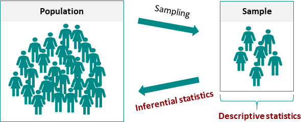
		- **Descriptive Statistics**
		  collapsed:: true
			- **Definition**: Descriptive statistics summarize and organize characteristics of a data set. A data set may include any number of observations, which could be a single variable or multiple variables.
			- **Example**: In a linguistics study, suppose we collect data on the number of requests made in a conversation based on gender. Descriptive statistics could include the average number of requests made by males and females, the range of requests, or the most common number of requests.
			- **Interpretation**: Descriptive statistics provide simple summaries about the sample and the measures. They form the basis of virtually every quantitative analysis of data.
			- **[[Microsoft Excel]]**: Descriptive statistics can be calculated in Excel using functions such as `AVERAGE`, `COUNT`, `MIN`, `MAX`, `STDEV.S`, and `VAR.S`.
		- **Inferential Statistics**
		  collapsed:: true
			- **Definition**: Inferential statistics use a random sample of data taken from a population to describe and make inferences about the population. Inferential statistics are valuable when it is not convenient or possible to examine each member of an entire population.
			- **Example**: From the same linguistics study, we might use inferential statistics to test hypotheses or make predictions. For instance, we might want to know if there's a significant difference between the number of requests made by males and females. We would use the data from our sample to infer something about the population.
			- **Interpretation**: Inferential statistics make inferences and predictions about a population based on a sample of data taken from the population in question.
			- [[Microsoft Excel]]: Inferential statistics can be performed in Excel using tools in the Data Analysis add-in, such as t-Tests, ANOVA, regression analysis, and more.
	- normal distribution and standard deviation
	  collapsed:: true
		- 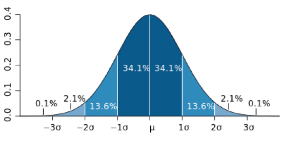
		  collapsed:: true
			- also called Gaussian distribution
		- **Normal Distribution**
		  collapsed:: true
			- **Definition**: A probability distribution that is symmetric about the mean, showing data near the mean are more frequent in occurrence than data far from the mean. In graph form, it looks like a bell curve.
			- **Example**: Human height is a common example of a normally distributed variable. If we measure the height of all adults in a large population, we would find that the heights follow a bell-shaped curve, with most people having a height close to the average, and fewer people being either much taller or much shorter than the average.
			  collapsed:: true
				- more examples
				  collapsed:: true
					- IQ scores
					- Blood pressure measurements
					- Test scores (e.g., SAT, standardized tests)
					- Birth weights of full-term babies
					- Shoe sizes within a population
					- Reaction times in psychological experiments
					- Annual rainfall in a specific region
					- Plant growth rates under controlled conditions
					- Salaries within a particular profession
					- Time taken to complete a specific task
					- Noise levels in urban environments
			- **Interpretation**: A normal distribution implies that the data is evenly distributed around the mean, and most of the data lies within a certain range of the mean. It's an idealized description of statistical data and not all datasets follow this distribution.
		- **Variance**
		  collapsed:: true
			- **Definition**: Variance is a statistical measurement of the spread between numbers in a data set. More specifically, variance measures how far each number in the set is from the mean (average) and thus from every other number in the set.
			- **Example**: For a dataset of human heights (in cm): 170, 172, 175, 168, 177, the variance calculation would involve several steps:
			  collapsed:: true
				- $$ \text{Variance} = \frac{{(170-172.4)^2 + (172-172.4)^2 + (175-172.4)^2 + (168-172.4)^2 + (177-172.4)^2}}{5} $$
			- **Interpretation**: Variance gives us a measure of how much the data in our set varies. If the variance is high, the data points are spread out over a wide range of values. If the variance is low, the data points are close to the mean.
			- **[[Microsoft Excel]]**: To calculate variance in Microsoft Excel, you can use the `VAR.P` function for population variance or `VAR.S` for sample variance.
		- **Standard Deviation**
		  collapsed:: true
			- **Definition**: The standard deviation is a measure of the amount of variation or dispersion of a set of values. A low standard deviation indicates that the values tend to be close to the mean, while a high standard deviation indicates that the values are spread out over a wider range.
			- **Example**: For the same height dataset, calculating the standard deviation would give us a quantitative measure of how much the heights deviate from the average. The calculation involves several steps, and it's the square root of the variance.
			  collapsed:: true
				- $$ \text{Standard Deviation} = \sqrt{\text{Variance}} = \sqrt{\frac{{(170-172.4)^2 + (172-172.4)^2 + (175-172.4)^2 + (168-172.4)^2 + (177-172.4)^2}}{5}} $$
			- **Interpretation**: The standard deviation is a more robust measure of spread than the range as it takes into account how each data point relates to the mean. A high standard deviation means the data are spread out over a large range of values, and vice versa.
			- **[[Microsoft Excel]]**: To calculate standard deviation in Microsoft Excel, you can use the `STDEV.P` function for population standard deviation or `STDEV.S` for sample standard deviation.
	- measures of central tendency (mean - median - mode)
	  id:: faa8080e-11c0-4b48-856e-4b4dd8c6c365
	  collapsed:: true
		- 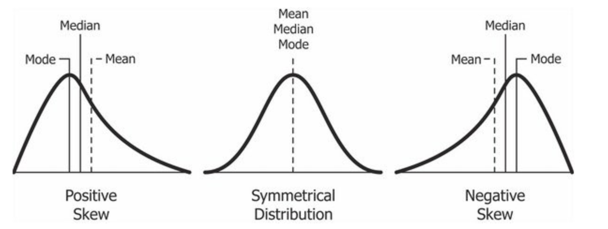
		- tutorial on Khan Academy: https://www.khanacademy.org/math/statistics-probability/summarizing-quantitative-data/mean-median-basics/a/mean-median-and-mode-review
		- **Mean**
			- **Definition**: The average of a set of numbers, calculated by adding up all the numbers and dividing by the quantity of numbers.
			- **Example**: For sentence lengths of 5, 8, 10, 10, and 35 words, the mean is calculated as follows:
				- $$ \text{Mean} = \frac{{5+8+10+10+35}}{5} = 13.6 \text{ words} $$
			- **Interpretation**: The mean is influenced by outliers and can provide a sense of overall word usage, but it may not accurately represent the most typical sentence length in the presence of extreme values.
		- **Median**
			- **Definition**: The middle value in a numerically ordered set of numbers. If there's an even quantity of numbers, it's the average of the middle two.
			- **Example**: For sentence lengths of 5, 8, 10, 10, and 35 words (ordered: 5, 8, 10, 10, 35), the median is 10 words.
			- **Interpretation**: The median is not affected by outliers, and it provides a measure of the typical sentence length that's robust to extreme values.
		- **Mode**
			- **Definition**: The most frequently occurring value in a set of numbers.
			- **Example**: For sentence lengths of 5, 8, 10, 10, and 35 words, the mode is 10 words.
			- **Interpretation**: Like the median, the mode isn't affected by outliers, and it can provide information about the most common sentence length.
		- **Key Differences**
			- The mean can be skewed by outliers and may not represent the typical value if the data is skewed.
			- The median and mode are less sensitive to outliers and can often provide a better sense of the most typical values in a skewed dataset.
			- Depending on the nature and distribution of the data, one measure may be more appropriate to use over the others.
	- significance testing
	  collapsed:: true
		- **Definition**: Significance testing is a statistical method that tests a hypothesis. It determines whether the observed data deviate from what is expected under the null hypothesis (H0), which generally states that there is no effect or difference.
		- **Example**: In the previous linguistics study, a significance test could be used to determine if there's a significant difference in the number of requests made by males and females. The null hypothesis might be that there is no difference in the number of requests made by males and females. The alternate hypothesis (H1) would be that there is a difference.
		- **Interpretation**: The result of a significance test is expressed as a p-value. A small p-value (typically ≤ 0.05) indicates strong evidence against the null hypothesis, so you reject the null hypothesis. A large p-value (> 0.05) indicates weak evidence against the null hypothesis, so you fail to reject the null hypothesis.
		- **[[Microsoft Excel]]**
			- `T.TEST()`: Performs a t-test to determine if there's a significant difference between the means of two groups
				- Linguistic applications:
					- Compare average word lengths between two corpora
					- Analyze differences in sentence complexity scores between genres
					- Evaluate frequency of specific grammatical structures in different text types
				- Syntax: `=T.TEST(array1, array2, tails, type)`
				- Example: Comparing mean sentence length in academic vs. informal texts
					- `array1`: Sentence lengths from academic corpus
					- `array2`: Sentence lengths from informal corpus
			- `CHISQ.TEST()`: Performs a chi-square test of independence to analyze the relationship between categorical variables
				- Linguistic applications:
					- Examine distribution of parts of speech across different text genres
					- Investigate the relationship between text type and use of specific linguistic features
				- Syntax `=CHISQ.TEST(observed_range, expected_range)`
				- Example: Analyzing distribution of modal verbs in scientific vs. literary texts
					- `observed_range`: Actual counts of modal verbs in each corpus
					- `expected_range`: Expected counts based on corpus sizes
			- `CORREL()`: Calculates the Pearson correlation coefficient between two sets of values
				- Linguistic applications
					- Examine relationship between text length and lexical diversity measures
					- Analyze correlation between frequency of certain words and text difficulty scores
					- Investigate associations between different linguistic features across texts
				- Syntax `=CORREL(array1, array2)`
				- Example: Correlating type-token ratio with text length in a corpus
					- `array1`: Type-token ratios for each text
					- `array2`: Word counts for each text
	- true and false positives
	  collapsed:: true
		- matrix
			- 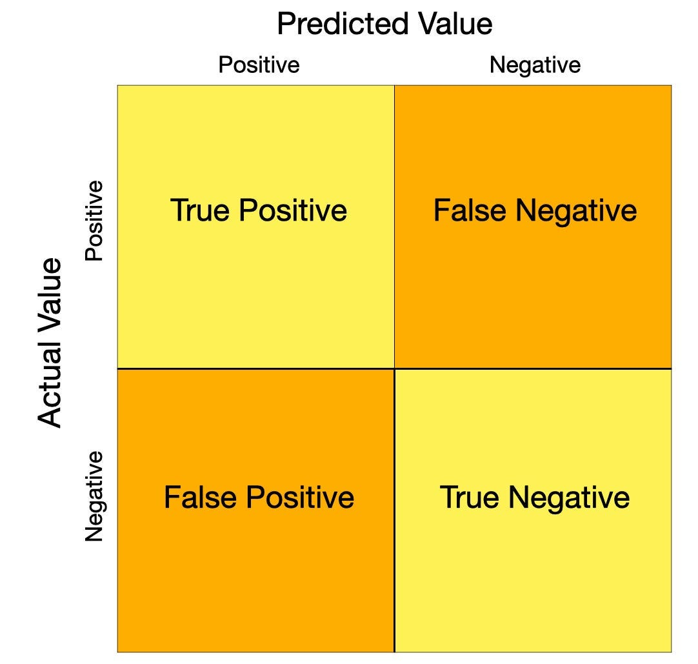{:height 489, :width 432}
		- **Example**: In the context of a corpus search query, suppose we're looking to find sentences that contain requests. Our "test" is the search query we're using. A "positive" result is when our query correctly identifies a sentence, whether it's identifying a request or correctly identifying a non-request.
			- **True Positive (TP)**: This occurs when the search query correctly identifies a sentence as containing a request. This is a successful detection of a real request.
			- **False Positive (FP)**: This happens when the search query incorrectly identifies a sentence as containing a request, but it doesn't. This is a "false alarm" — the test mistakenly signaled a request where there wasn't one.
			- **True Negative (TN)**: This is when the search query correctly identifies a sentence as not containing a request. This means the test correctly identified a sentence without a request.
			- **False Negative (FN)**: This occurs when the search query fails to identify a sentence that does contain a request. This is a "miss" — the test failed to detect a real request.
	- measures of frequency (presented in charts, bars, pies etc.)
	  id:: 47c6f7a8-a572-4ea8-a61e-2b31641b34f6
	  collapsed:: true
		- [[absolute frequency]]: count/number of occurrences in the corpus
		- [[relative frequency]]: typically: per million words in the corpus
		- in [[corpora]]
		  collapsed:: true
			- [[english-corpora.org]]
				- `FREQ`: [[absolute frequency]]
				- `WORDS (M)`: [[corpus size]]
				- `PER MIL`: [[relative frequency]]
				- query for `phone` in the [[COHA]]
					- 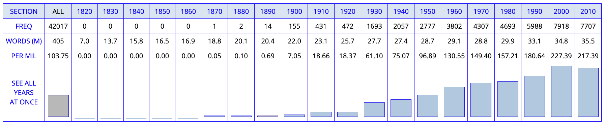
			- on [[Sketch Engine]]
				- `Number of hits`: [[absolute frequency]]
				- `Number of hits per million tokens`: [[relative frequency]]
				- query for `[lemma="phone"]` in the [[Gutenberg English 2020]] corpus ([query link](https://app.sketchengine.eu/#concordance?corpname=preloaded%2Fgutenberg20_en&tab=advanced&queryselector=cql&attrs=word&viewmode=kwic&attr_allpos=all&refs_up=0&shorten_refs=0&glue=1&gdexcnt=300&show_gdex_scores=0&itemsPerPage=20&structs=s%2Cg&refs=%3Dbook.title&default_attr=lemma&cql=%5Blemma%3D%22phone%22%5D&showresults=1&showTBL=0&tbl_template=&gdexconf=&f_tab=advanced&f_showrelfrq=1&f_showperc=1&f_showreldens=0&f_showreltt=0&c_customrange=0&operations=%5B%7B%22name%22%3A%22cql%22%2C%22arg%22%3A%22%5Blemma%3D%5C%22phone%5C%22%5D%22%2C%22query%22%3A%7B%22queryselector%22%3A%22cqlrow%22%2C%22cql%22%3A%22%5Blemma%3D%5C%22phone%5C%22%5D%22%2C%22default_attr%22%3A%22lemma%22%7D%2C%22id%22%3A2819%7D%5D))
					- 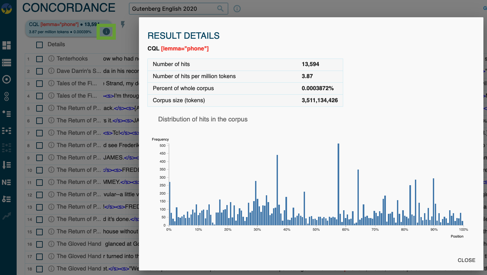
- organising your data: *tidy data* (Hadley Wickham)
  id:: 649bccb1-2184-4e95-8e2d-e719c4755401
	- Each observation forms a **row**
	  collapsed:: true
		- **Definition**: Every single observation should be in a different row.
		- **Example**: In the men and women using requests data, an observation could be the number of requests made by a particular person in a conversation. In Excel, this means each row should represent one such observation.
	- Each variable forms a **column**
	  collapsed:: true
		- **Definition**: In tidy data, each variable should have its own column. This allows for clear visibility and easy manipulation of individual variables.
		- **Example**: In the men and women using requests data, for instance, variables such as "gender" and "number of requests" would each have their own column in [[Microsoft Excel]].
	- Each type of observational unit forms a **table**
	  collapsed:: true
		- **Definition**: Different types of observational units should be kept in different tables (or different sheets in Excel).
		- **Example**: If you're collecting data about both individual conversation instances and cumulative data across several conversations, those should be in two different sheets in Excel.
	- **Column names** should be descriptive
	  collapsed:: true
		- **Definition**: Column names should give clear information about the data contained within the column.
		- **Example**: In Excel, make sure to give each column a header that accurately describes the data it contains. For instance, in the case of the men and women using requests data, the column headers could be "Gender" and "RequestsNumber".
	- Store **metadata** separately
	  collapsed:: true
		- **Definition**: Information about the data (metadata) such as the data collection process, data coding guide, etc. should be stored separately from the data itself.
		- **Example**: In Excel, this could mean having a separate sheet for metadata where you explain the coding process for determining what counts as a "request" in a conversation or which query you have used to retrieve them.
	- Avoid wide format, favor **long format**
	  collapsed:: true
		- **Definition**: Wide format spreads data across many columns and can be harder to work with. Long format keeps data in a 'tall' structure that is more conducive to many types of analysis.
		- **Example**: In Excel, this might mean restructuring data so that there are more rows and fewer columns. For example, instead of having separate columns for "Number of Requests by Men" and "Number of Requests by Women", you could have one column for "Gender" and one column for "Number of Requests".
	- **DRY**: Don't Repeat Yourself
	  collapsed:: true
		- **Definition**: A principle emphasizing the reduction of repetition in data and code. It aims to make work more efficient and less prone to errors by avoiding duplication of information.
		- **Example**: Instead of manually creating multiple tables to show word frequencies across different text genres, use a pivot table. This allows you to dynamically generate various views of the data from a single source, reducing repetition and the risk of inconsistencies when updating information.
- general tips for using [[Microsoft Excel]]
	- use **new tabs** for your analyses to keep raw data and analysis separate
	- create **tables**
	- **pivot tables** are very powerful for analysing your data
	- **pivot charts** give you ready visualisations of the data you analyse in a pivot table
	  collapsed:: true
		- 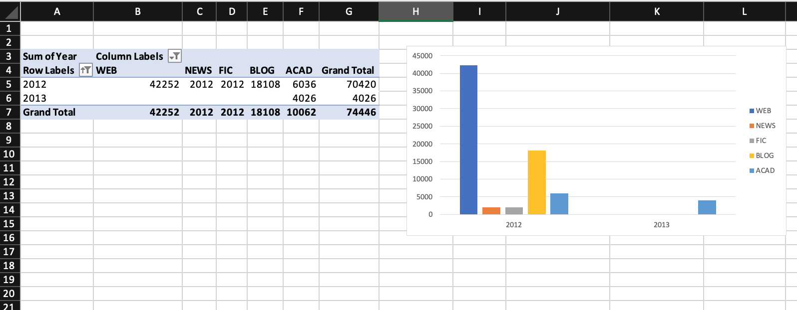
		  id:: 649bccb1-6ddc-4061-a266-5566888ab58b
		  collapsed:: true
- [[practice]]: using [[Sketch Engine]] and [[Microsoft Excel]] for studying clipping
	- background: [[Hilpert2023Meaning]]
	  id:: 64b6d19e-ae77-4d06-b79c-2b7e8b5b88fd
	  collapsed:: true
		- 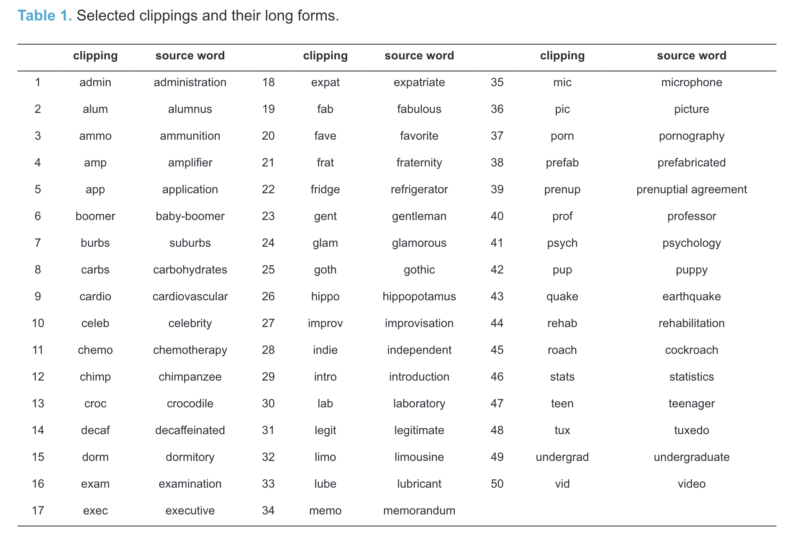
		  id:: c6190a47-ca17-4d77-89fb-e8f8c72d6f2c
		  collapsed:: true
	- for example pairs of (1) source words (e.g. *brother*) and (2) clipped form (e.g. *bro*)
		- query for
		  collapsed:: true
			- lexeme-based: both *brother* and *brothers*
			- word class
		- determine their [[frequency]]
		  id:: ab462d4c-710b-4366-992c-93e25c855823
			- total frequency in the [[English Trends]] corpus
				- determine frequency
					- [[absolute frequency]]
					- [[relative frequency]]
				- collect results
					- enter information in this [[Microsoft Excel]] spreadsheet: https://1drv.ms/x/s!AvkgNVl9yS6aoH-5X3P1zsKIkDTG
		- analyse results using [[Microsoft Excel]]
		  id:: 24010604-ede4-474d-8fe4-f3cda5b86f78
			- insert `Table` for range of data
			  collapsed:: true
				- 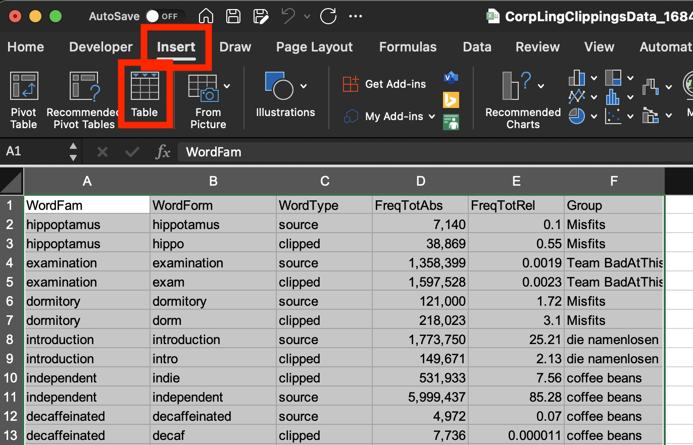
			- insert `Pivot Table` for `Table`
			  collapsed:: true
				- 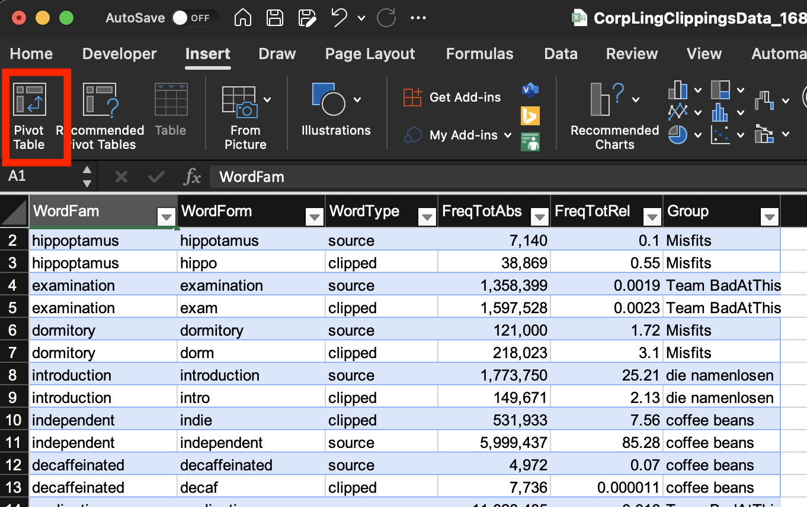
			- set `Rows`, `Values`, and `Columns`
			  collapsed:: true
				- 
				- remove `Grand Total` by right-click → remove
			- insert `Pivot Chart`
			  collapsed:: true
				- 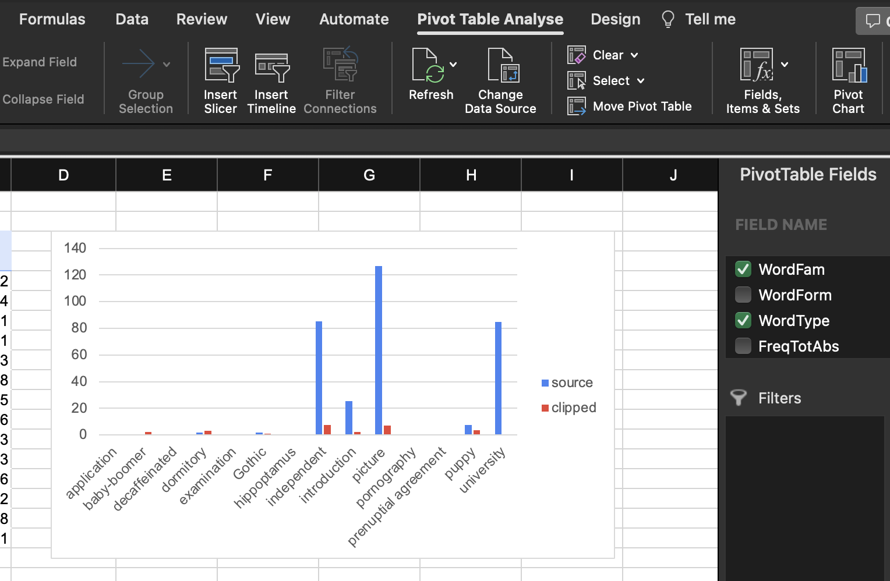