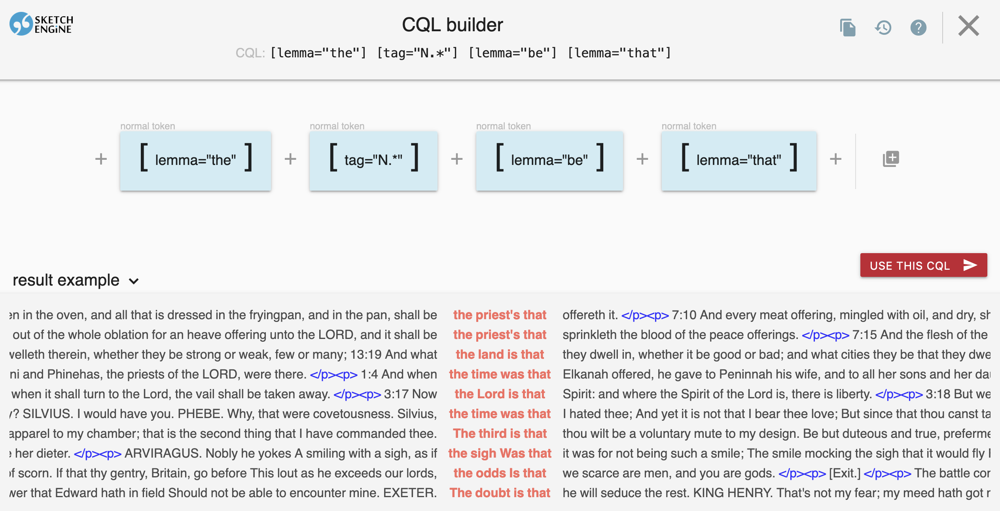
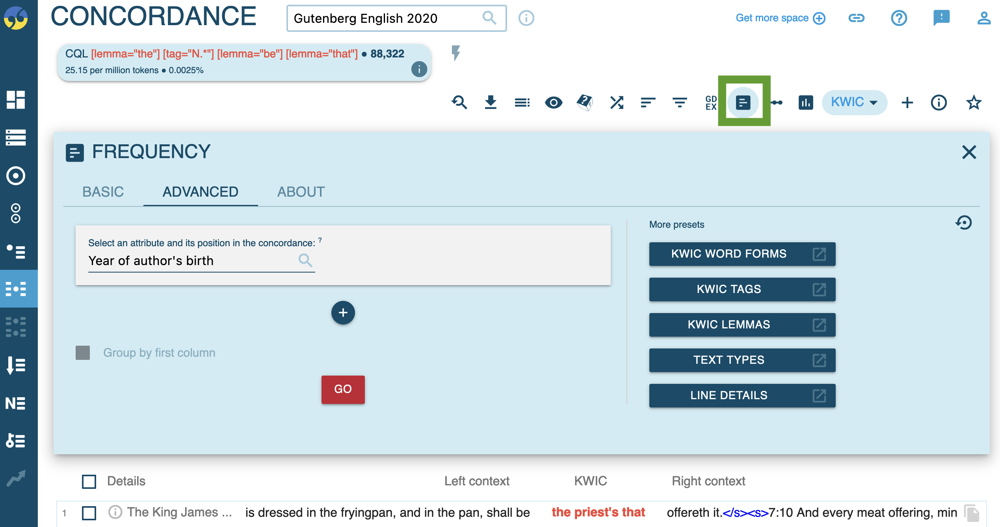
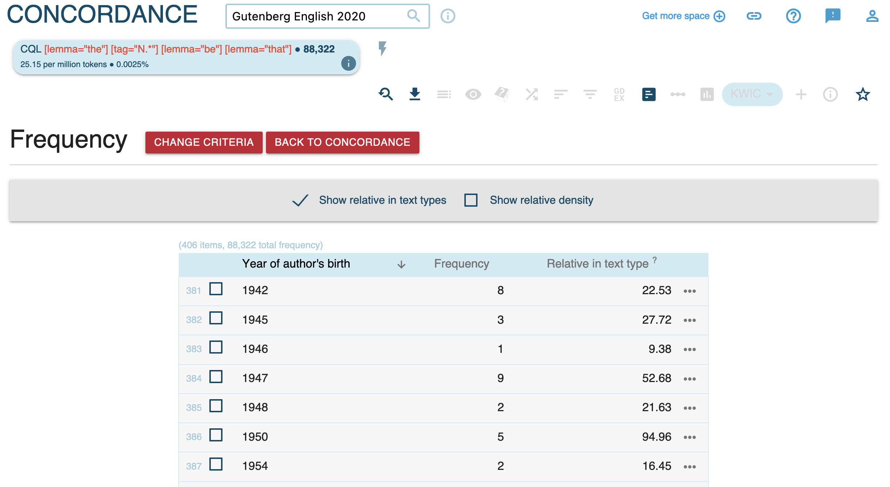
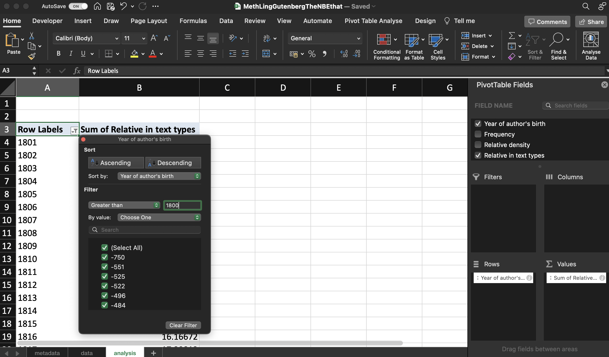
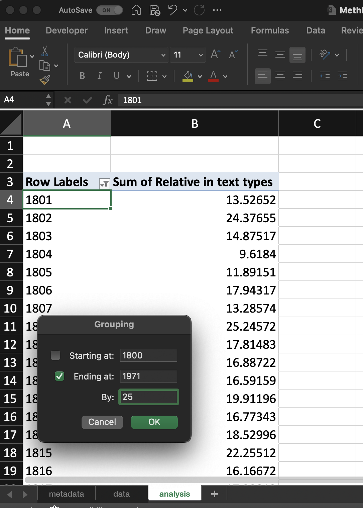
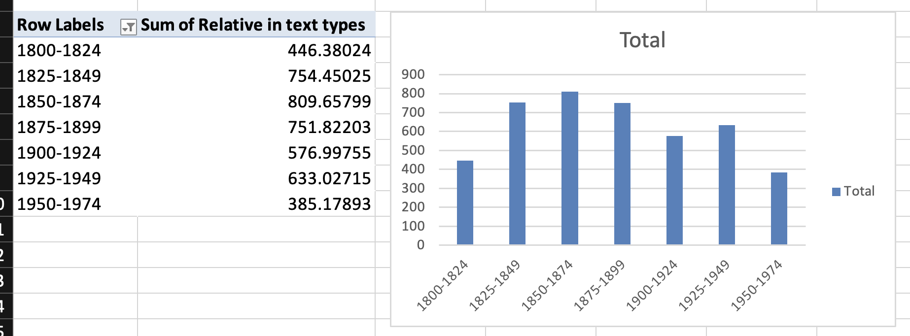
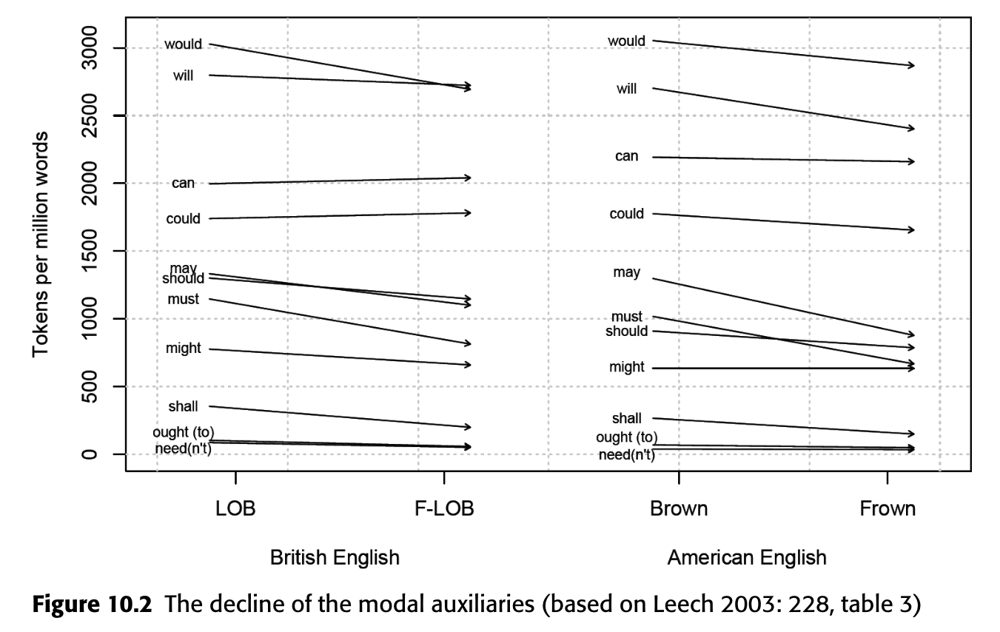
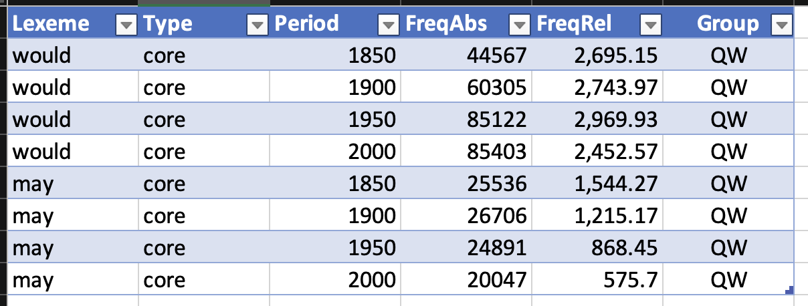

- recap: fundamentals of analysing data
  collapsed:: true
	- {{embed [[10 – Analysing data]]}}
- [[practice]]: managing corpora with images with [[Microsoft Excel]]
  id:: 64a44ee3-a5dd-4ebe-85ba-779bb49944df
  collapsed:: true
	- https://kreativefriseurnamen.tumblr.com/
	- spreadsheet: https://1drv.ms/x/s!AvkgNVl9yS6aoQ5L6nbWv-w2G4pE?e=rnQDhe
	- folder with images: https://1drv.ms/f/s!AvkgNVl9yS6aoQ07v4ueQxWfxLf-?e=f6eoVp
- [[practice]]: analysing corpus data with [[Microsoft Excel]]
  id:: 64a45395-0719-4509-8875-9e2bb910dd6c
	- based on [[Sketch Engine]]
		- [[diachronic]] [[frequency]] in the [[Gutenberg English 2020]] corpus: `the N BE that` ([[Schmid2015Entrenchment]])
		  collapsed:: true
			- abstract
			  collapsed:: true
				- ((fee260ec-d356-41d3-b525-3c88b7df14fb))
			- query
			  collapsed:: true
				- 
				- [query link](https://app.sketchengine.eu/#concordance?corpname=preloaded%2Fgutenberg20_en&tab=advanced&queryselector=cql&attrs=word&viewmode=kwic&attr_allpos=all&refs_up=0&shorten_refs=0&glue=1&gdexcnt=300&show_gdex_scores=0&itemsPerPage=20&structs=s%2Cg&refs=%3Dbook.title&default_attr=lemma&cql=%5Blemma%3D%22the%22%5D%20%5Btag%3D%22N.*%22%5D%20%5Blemma%3D%22be%22%5D%20%5Blemma%3D%22that%22%5D&showresults=1&showTBL=0&tbl_template=undefined&gdexconf=undefined&cb=slemma%3D%22the%22%23stag%3D%22N.*%22%23slemma%3D%22be%22%23slemma%3D%22that%22&f_tab=advanced&f_showrelfrq=1&f_showperc=1&f_showreldens=0&f_showreltt=0&c_customrange=0&operations=%5B%7B%22name%22%3A%22cql%22%2C%22arg%22%3A%22%5Blemma%3D%5C%22the%5C%22%5D%20%5Btag%3D%5C%22N.*%5C%22%5D%20%5Blemma%3D%5C%22be%5C%22%5D%20%5Blemma%3D%5C%22that%5C%22%5D%22%2C%22query%22%3A%7B%22queryselector%22%3A%22cqlrow%22%2C%22cql%22%3A%22%5Blemma%3D%5C%22the%5C%22%5D%20%5Btag%3D%5C%22N.*%5C%22%5D%20%5Blemma%3D%5C%22be%5C%22%5D%20%5Blemma%3D%5C%22that%5C%22%5D%22%2C%22default_attr%22%3A%22lemma%22%7D%2C%22id%22%3A308%7D%5D)
				- 
				- 
				- export to [[Microsoft Excel]]
			- sheet: https://1drv.ms/x/s!AvkgNVl9yS6aoQmE_mZMQVoib6Hh
				- filtering `> 1800`
				  collapsed:: true
					- 
				- grouping
				  collapsed:: true
					- 
				- bar chart
				  collapsed:: true
					- 
	- based on [[english-corpora.org]]
		- [[language change]] among modal verbs ([[Hilpert2015Grammatical]])
			- [[Microsoft Excel]] spreadsheet: https://1drv.ms/x/s!AvkgNVl9yS6aoQtzvHHut-cqJceL
			- theoretical background
			  collapsed:: true
				- ((64a45f71-5e81-41bf-a885-9593ef51ade3))
				- Modal verbs in English
				  id:: 64a45fa0-fb5a-47d4-ba93-a23b5a01fb86
					- core modal verbs
						- will
						- would
						- can
						- could
						- may
						- might
						- shall
						- should
						- must
					- peripheral modal verbs
						- BE going to
						- have to
						- got to
						- need to
				- changes in frequency
					- “Another domain of English grammar that is currently undergoing change is the domain of modality, specifically the modal auxiliaries. In the most general of terms, the situation is that several of the core modal auxiliaries” ([[Hilpert2015Grammatical]]: 185)
					- “are declining in text frequency (Leech 2003; Mair 2006), while at the same time new quasi-modal elements are undergoing grammaticalization (Krug 2000).” ([[Hilpert2015Grammatical]]: 186)
					- 
						- [[Hilpert2015Grammatical]]: 186
					- changes observed in previous literature
					  id:: 64a46021-3dc9-4175-a325-e46880c0f1a6
						- decreases
							- would
							- may
							- should
							- must
							- shall
						- increases
							- BE going to
							- have to
							- got to
							- need to
					- “The result is a dynamic situation that raises a number of questions. For instance, it has been asked why certain forms are in decline whereas others are on the upswing. Is there a relation between these developments, and if so, how do we assign the roles of cause and effect?” ([[Hilpert2015Grammatical]]: 186)
					- potential cause: [[text type/variation]]
						- “One explanation for the discrepancies between the tendencies in the Brown family of corpora and in the Time corpus is the composition of the respective corpora. Whereas the Brown corpora represent a balanced set of genres, the Time corpus represents a single text type. To test whether genre differences explain the discrepancies, Millar (2009: 207) compares his Time results against an analysis of the press genres in the Brown and Frown corpora, finding, however, no satisfactory convergence between the two. Millar thus invokes sampling error as an explanation, which is criticized by Leech (2011a), who replicates the results from the Brown family of corpora on the basis of the balanced diachronic mega-corpora COCA and COHA (Davies 2008, 2010). These results leave the frequency increases of can, could,andmay in Time in need of an explanation, for which Leech (2011a: 557) suggests a genre-specific style change in journalistic writing.” ([[Hilpert2015Grammatical]]: 187)
			- [[diachronic]] [[frequency]] in the [[COHA]]
			  collapsed:: true
				- for each of the following modal verbs
					- {{embed ((64a46021-3dc9-4175-a325-e46880c0f1a6))}}
				- determine their absolute and relative frequencies in the decades
					- 1850
					- 1900
					- 1950
					- 2000
					- 
				- create bar charts that show
					- whether these individual words show frequency changes over time
					- whether the groups of (1) core and (2) peripheral modal verbs show frequency changes on aggregate
			- [[text type/variation]] in the [[COCA]]
			  collapsed:: true
				- Investigating whether those modals that exhibit the highest changes in frequency show (changes in) preferences for specific text types using the [[COCA]]
					- **[[Coefficient of Variation]] (CV)**
						- **Definition**: The coefficient of variation (CV) is a statistical measure that describes the relative variability of data. It is calculated as the ratio of the standard deviation to the mean, and is often expressed as a percentage. This measure is particularly useful when comparing the degree of variation from one data series to another, even if the means are drastically different from each other.
						- **Application**: In the context of corpus linguistics, the CV can be used to measure the variability of word frequencies across different texts or corpora.
						- **Mathematical Formula**
							- CV = (Standard Deviation / Mean)
							- $$ CV = \left( \frac{\sigma}{\mu} \right) $$
						- **Calculation in Excel**
							- 1. **Calculate the Mean**: Use the `AVERAGE` function in Excel to calculate the mean of your data. If your data is in cells A1 to A10, you would type `=AVERAGE(A1:A10)` in a new cell.
							- 2. **Calculate the Standard Deviation**: Use the `STDEV.P` function (for a whole population) or the `STDEV.S` function (for a sample) in Excel to calculate the standard deviation. If your data is in cells A1 to A10, you would type `=STDEV.P(A1:A10)` or `=STDEV.S(A1:A10)` in a new cell.
							- 3. **Calculate the Coefficient of Variation**: Divide the standard deviation by the mean and multiply by 100 to get the coefficient of variation. If your mean is in cell B1 and your standard deviation is in cell B2, you would type `=(B2/B1)*100` in a new cell.