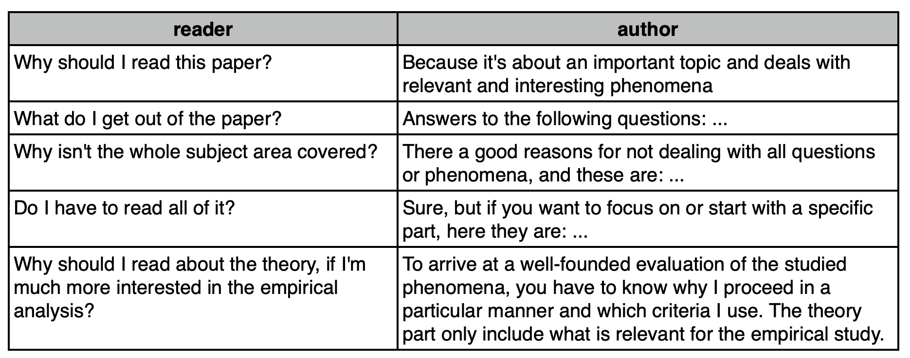

- recap: analysing data
  collapsed:: true
	- {{embed ((64a44ee3-a5dd-4ebe-85ba-779bb49944df))}}
	- {{embed ((64a45395-0719-4509-8875-9e2bb910dd6c))}}
- [[writing]]
	- start early
	  collapsed:: true
		- *Phase I*: before you even start, write a proposal/abstract/summary of your ideas, main hypotheses, your research diary
		- *Phase II*: write while you read
		- *Phase III*: start writing proper with an easy chapter, then go on to the more difficult ones
		- *Phase IV*: revise completed chapters - always check your chapters against your table of contents and if necessary rearrange
		- *Phase V*: write Introduction and Conclusion (also other technical parts like appendix, bibliography etc.)
		- *Phase VI*: revise the complete text - check for coherence ('roter Faden’) once again
		- *Phase VII*: have your text proof-read by a friend and/or a native speaker
		- *Phase VIII*: work in corrections and comments and make a final draft, print it and proof-read it a last time
	- develop a writing habit
	  id:: 64ad829f-41b9-4d5c-9105-376d416c09fc
	  collapsed:: true
		- Advantages of a Writing Habit
		  collapsed:: true
			- Regular Practice
			  collapsed:: true
				- Writing regularly helps to improve your writing skills over time. The more you write, the better you become at expressing your thoughts clearly and concisely.
			- Consistency
			  collapsed:: true
				- A consistent writing habit can help you make steady progress on your papers and assignments, reducing the stress of last-minute work.
			- Improved Understanding
			  collapsed:: true
				- Writing about a topic can enhance your understanding of it. It forces you to think deeply about the subject and articulate your thoughts and arguments clearly.
			- Development of Critical Thinking
			  collapsed:: true
				- Regular writing encourages critical thinking as it requires you to evaluate information, make connections, and form arguments.
			- Enhanced Research Skills
			  collapsed:: true
				- A consistent writing habit often involves regular reading and research, which can improve your ability to find and understand relevant literature.
		- How to Establish a Writing Habit
		  collapsed:: true
			- Set a Schedule
			  collapsed:: true
				- Dedicate a specific time each day for writing. This could be early in the morning, during lunch breaks, or in the evening.
			- Start Small
			  collapsed:: true
				- Don't overwhelm yourself by trying to write for hours at a time. Start with short, manageable writing sessions and gradually increase the time as you get comfortable.
			- Set Goals
			  collapsed:: true
				- Have clear, achievable goals for each writing session. This could be writing a certain number of words, completing a section of your paper, or revising a chapter.
			- Create a Conducive Environment
			  collapsed:: true
				- Find a quiet, comfortable place where you can focus on your writing without distractions.
			- Use Tools
			  collapsed:: true
				- Use writing tools and apps that can help you stay organized, check your grammar, and keep track of your sources.
			- Seek Feedback
			  collapsed:: true
				- Regularly share your work with others and seek their feedback. This can provide valuable insights and help you improve your writing.
	- text components
	  collapsed:: true
		- Introduction
		  collapsed:: true
			- Fictional dialogue between reader and author (cf. [Franck2006Technik](Franck2006Technik): 143):
			  collapsed:: true
				- 
		- Main body
		  collapsed:: true
			- consists of all the chapters that together result in a comprehensive picture
			- often starts with a chapter on the state of the art / literature review or on the theoretical background
			- often has a section on definitions of necessary theoretical concepts and notions
			- research questions can be answered in separate chapters or as a kind of common thread ( 'roter Faden') throughout the whole paper
			- includes chapters on methods, material
			- mostly ends with a chapter on the results of the study and an interpretation
		- Conclusion
		  collapsed:: true
			- summary
			- discussion of main findings
			- limitations, outlook (future work)
			- implications for related work
			- implications for your research question
	- structure
	  collapsed:: true
		- clear overall structure, logical relation between sections and subsections
		- balanced relation theoretical - empirical and between chapters
		- table-of-content-types:
		  collapsed:: true
			- chronological
			- systematic
			  collapsed:: true
				- sections have the same value for the topic; e.g. central issues, functions, theories  & concepts
			- deductive
			  collapsed:: true
				- general >> particular; draw a conclusion from a hypothesis/theory
			- inductive
			  collapsed:: true
				- material >> conclusion and theory; draw a conclusion from observation
			- causal
			  collapsed:: true
				- cause >> consequences
			- comparative
			  collapsed:: true
				- establish relations between various aspects
			- empirical
			  id:: 64ad7d2f-fcd8-4c49-a57b-946b3984a34a
				- Introduction
					- This section should provide an overview of the topic, the context, and the relevance of the research. It should also include the research question or hypothesis, and a brief summary of what the paper will cover.
				- Theoretical Background
					- This section should provide a detailed review of the existing literature relevant to your research question. It should highlight the theories and findings of previous studies, and how they relate to your own research. This section should also define any key terms and concepts.
				- Data
					- This section should describe the data that you will be analyzing in your study. This could include the source of the data, the criteria for selection, and any relevant characteristics of the data. In a corpus linguistic paper, this would typically involve describing the corpus that you are using.
				- Method
					- This section should describe the methods you used to analyze your data. This should include any specific techniques or procedures, as well as any software or tools used. In a corpus linguistic paper, this might involve describing how you used a particular software tool to analyze the frequency and distribution of certain linguistic features in your corpus.
				- Results
					- This section should present the findings of your analysis. It should be clear and concise, and use tables, graphs, or other visual aids where appropriate. The results should be presented in a way that directly addresses your research question or hypothesis.
				- Discussion
					- This section should interpret the results in the context of your research question and the existing literature. It should discuss whether the results support your hypothesis, and what implications they have for the field of linguistics. This section may also identify any limitations of your study, and suggest areas for future research.
				- Conclusion
					- This section should provide a summary of your research, the main findings, and the implications of these findings. It should also restate the relevance of your research and provide a final thought or reflection on the study.
	- style and readability
	  collapsed:: true
		- be concrete and explain
		- do not presuppose too much prior knowledge on the part of your reader
		- aim for a neutral – scientific – academic style
		- aim for understandable – precise – clear formulations
		- *I* vs *one* vs *we* vs *the author*
		- delete superfluous information – include necessary information
		- avoid long and complicated sentences
		- use topic sentences
		- use examples
		- put the main thing in the main clause
		- use full stops
		- Avoid fillers
		- use active instead of passive
		- use verbs instead of nouns
	- avoiding writer's block
	  collapsed:: true
		- Start writing as early as possible
		- Do not compare your own product to those of experienced writers
		- Know your writing type
		- Fix a preferred time and appropriate surrounding for your writing process
		- Do take breaks
		- Think in smaller steps, look for short-term aims
		- Formulate in one or two paragraphs the aims and hypotheses of your paper
		- Talk to someone (anyone) about your problems
		- Produce difficult parts and/or revise in handwriting
	- separating writing from editing
	  id:: 64ad85a7-6160-48e1-87f3-04010036c02e
	  collapsed:: true
		- Advantages of Separating Writing from Editing
		  collapsed:: true
			- Increased Productivity
			  collapsed:: true
				- By focusing solely on getting your ideas down during the writing phase, you can maintain a steady flow of thoughts and increase your overall productivity.
			- Reduced Anxiety
			  collapsed:: true
				- Separating writing from editing can reduce the anxiety and self-doubt that often come with trying to perfect your work as you write.
			- Enhanced Creativity
			  collapsed:: true
				- When you're not constantly critiquing and editing your work, you allow more room for creative thinking and exploration of ideas.
			- Improved Clarity
			  collapsed:: true
				- Editing after writing allows you to review your work with fresh eyes, leading to improved clarity and coherence.
		- How to Implement Separating Writing from Editing
		  collapsed:: true
			- Dedicated Writing Time
			  collapsed:: true
				- Set aside specific time for writing where your only goal is to get your thoughts down on paper.
			- Dedicated Editing Time
			  collapsed:: true
				- Similarly, set aside separate time for editing. Use this time to refine your work, correct errors, and improve clarity.
			- Use Tools
			  collapsed:: true
				- Consider using writing tools that have a "distraction-free" mode, which hides editing tools during the writing phase.
			- Take Breaks Between Writing and Editing
			  collapsed:: true
				- Taking a break between writing and editing can give you a fresh perspective when you return to your work.
			- Seek Feedback
			  collapsed:: true
				- After you've done your own editing, consider getting feedback from others. They can provide a fresh perspective and may catch things you missed.
	- adjusting: back and forth
	  collapsed:: true
		- Sticking to the topic/central theme
		  collapsed:: true
			- During the writing process, have your table of contents in mind, and adjust the structure, if necessary. **Rearrange** sections, delete irrelevant parts, fill in missing sections etc.
			- Start writing with an **easy chapter**, e.g. the state of the art, data description. Or transform your excerpts for a chapter into a coherent text.
		- Final overview
		  collapsed:: true
			- Before writing introduction and conclusion, **re-read** your text controlling for the structure and the central theme.
			- Make sure you are explicit about relevant notions and give evidence and illustrations for your claims.
			- Control for the consistent use of linguistic conventions and a correct referencing throughout your paper.
	- tools
	  id:: 64ad7c6d-6063-4529-b7de-3421d62a34db
	  collapsed:: true
		- dictionaries
		  collapsed:: true
			- [linguee](https://www.linguee.de/)
			- [dict](https://www.dict.cc/)
		- thesauri
		  collapsed:: true
			- [thesaurus.com](https://www.thesaurus.com/)
		- collocations
		  collapsed:: true
			- [ozdic.com](https://ozdic.com/)
			- [netspeak](https://netspeak.org)
		- spelling and grammar checking
		  collapsed:: true
			- [Grammarly](https://www.grammarly.com/)
			  collapsed:: true
				- Grammarly is a widely-used digital writing assistant that helps you eliminate writing errors and find the perfect words to express yourself. It offers real-time grammar, spelling, and punctuation checks, along with style improvements to ensure your writing is clear and engaging. Grammarly also provides detailed explanations for all your mistakes and weekly progress reports to help you understand your strengths and areas for improvement. It's a great tool for academic writing, but remember to review its suggestions to ensure they fit the context of your work.
			- [LanguageTool](https://languagetool.org/)
			  collapsed:: true
				- LanguageTool is a multilingual spelling, style, and grammar checker that helps correct or paraphrase texts. It offers a wide range of language support and can be integrated into various platforms like browsers, word processors, and email clients. LanguageTool is particularly useful for checking grammar and spelling in over 20 languages, and it also provides style and punctuation suggestions. However, as with any automated tool, it's important to review and understand the changes it suggests to ensure they align with your original intent and academic standards.
		- AI-based tools
		  collapsed:: true
			- [QuillBot](https://quillbot.com/)
			  collapsed:: true
				- QuillBot is an AI-powered paraphrasing tool that can help students and professionals rewrite, edit, and change the tone of their text to improve clarity and comprehension. It can be used to rephrase any text in a variety of ways, ensuring you use the appropriate vocabulary, tone, and style for any occasion. It also offers a grammar checker, a plagiarism checker, and a summarizer among other features. However, it's important to use it responsibly and ensure that the final work is original and properly cited.
			- [PaperPal](https://paperpal.com/)
			  collapsed:: true
				- PaperPal is an advanced AI grammar checker and online academic writing tool that identifies language errors and provides instant, in-depth suggestions to help you polish your manuscript. It offers real-time, subject-specific language suggestions that help you write better and faster. It can check for key rejection parameters, identify and improve problem areas, and provide unlimited revisions and rechecks. It's a great tool for delivering high-quality research articles faster with suggestions to improve language, grammar, and readability as you write. However, always remember to review and understand the changes suggested by the tool to ensure they align with your original intent.
			- [ChatGPT](https://openai.com/chatgpt)
			  collapsed:: true
				- ChatGPT by OpenAI is an AI model that can generate human-like text based on the input it's given. It can be used as a tool to help with brainstorming, drafting and editing content, and learning new topics. It's capable of understanding context and providing detailed responses, making it a useful tool for academic writing. However, it's important to use it as a tool to assist your writing process, rather than relying on it to generate your entire paper. Always review and edit the suggestions provided by ChatGPT to ensure they meet your academic standards.
			- [DeepLWrite](https://www.deepl.com/write)
	- further reading
	  collapsed:: true
		- ((64ad8336-8140-499f-8e5b-8ecbdd2e15be))
		- ((64ad84f6-0a26-48bc-ad68-94ed11e57849))
		- ((64ad8573-b0e5-438d-86ab-34880f5084a2))
		- ((64af04f2-4293-4859-8e5e-709414724f1d))
		- ((64af058a-7fa0-455f-9427-e1b6468a8412))
- next week
  collapsed:: true
	- open issues?
	- preferences?