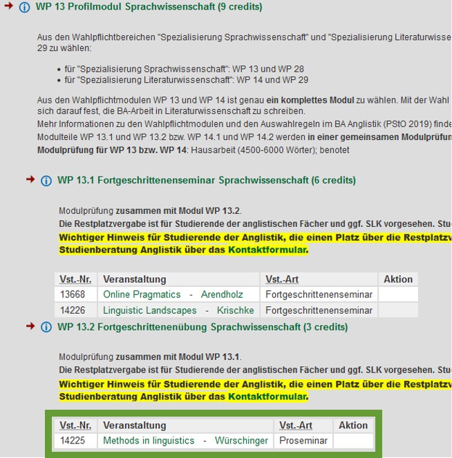

- assessment
  collapsed:: true
	- [[Modulprüfung]]
	  collapsed:: true
		- WP 13: Profilmodul Sprachwissenschaft
			- Wichtige Information **nur (!)** für Studierende im **BA Anglistik (PStO 2019, Studienbeginn WiSe 2019/20 oder später)**, die diese Lehrveranstaltung als Modul WP 13.2 belegt haben:
			- Modul WP 13.2 ist nur **ein** Teil des Gesamtmoduls WP 13, das mit **einer** Gesamt-Modulprüfung (**gemeinsame Prüfung über beide Modulteile hinweg**) endet, die erfordert, dass **beide Modulteile besucht** wurden.
			- Bitte überprüfen Sie deswegen anhand der Übersicht unten und Ihres Stundenplans noch einmal, ob Sie **in diesem Semester** auch tatsächlich **eine Veranstaltung im anderen Modulteil WP 13.1** belegt haben und für diese auch **zugelassen wurden**. **Sollte dies nicht der Fall sein, wenden Sie sich bitte schnellstmöglich an die Studiengangskoordinatorin (Frau Dr. Günther)**.
			- 
	- Thesenpapier
	  collapsed:: true
		- {{embed [[Thesenpapier]]}}
		-
- [[practice]] [[data analysis]] : using the [[NOW Corpus]] from [[english-corpora.org]] and [[Microsoft Excel]] to study clipping ([[Hilpert2023Meaning]])
	- background
		- {{embed ((64b6d19e-ae77-4d06-b79c-2b7e8b5b88fd))}}
	- collect your results in this spreadsheet: https://1drv.ms/x/s!AvkgNVl9yS6aoSQcruuTYt6AxMJK
	- [[diachronic]] [[frequency]]: Have these words increased in frequency over time (2010 vs 2020)?
		- Which corpora can we use?
			- [[NOW Corpus]] → [[english-corpora.org]]
			- [[Timestamped JSI web corpus 2014-2021 English]] → [[Sketch Engine]]
	- [[geographic variation]]: Are these words used more frequently in the US or in GB?
- recap
  collapsed:: true
	- note-taking
	  collapsed:: true
		- principles
		  collapsed:: true
			- {{embed ((6451ff83-befc-44c6-809d-554717158ba4))}}
		- [[logseq]]
		  collapsed:: true
			- 
	- research questions and hypotheses
	  collapsed:: true
		- {{embed ((645a6da4-1124-46e4-9517-512df2067082))}}
	- managing references
	  collapsed:: true
		- finding references
		  collapsed:: true
			- {{embed ((6463abc3-0579-42db-a65b-ccff44da6659))}}
			- {{embed ((6463abc3-ff8d-4f47-ab62-7f0ded4e8dcb))}}
			- {{embed ((6463ac07-9c1a-422a-80f3-ecb9d4829181))}}
		- citing references
		  collapsed:: true
			- {{embed ((6463b3b6-b8a2-4693-a21b-8f118d92cb95))}}
		- managing your library
			- {{embed ((6463a7be-7bb4-4623-9c5c-bf1a18a0da2b))}}
	- reading
	  collapsed:: true
		- {{embed ((6476206a-e328-42f8-b979-21b21eb36b90))}}
		- {{embed ((6476206a-220f-4cc7-8fc4-9111db544a3f))}}
	- self-management
	  collapsed:: true
		- {{embed ((647619b5-2f34-4eae-8fb4-6bac8253eba9))}}
		- {{embed ((647619b5-5152-44b7-9478-2217cfe63a89))}}
		- {{embed ((647619b5-776f-42db-b9a4-99655c7b26a3))}}
	- corpus linguistics
	  collapsed:: true
		- fundamental concepts
		  collapsed:: true
			- {{embed ((648033b8-e219-444d-83dd-04c79b44530c))}}
			- {{embed ((648033b8-7985-4fca-b09e-e5f18cfe1862))}}
		- english-corpora.org
		  collapsed:: true
			- {{embed ((648967e3-a1bb-43dc-957b-4e95eb21822b))}}
			- {{embed ((64896809-e84c-4885-bf8f-f1b73181834f))}}
		- Sketch Engine
		  collapsed:: true
			- {{embed ((648967c1-738a-439e-9283-49c8367d16c7))}}
	- questionnaires
	  collapsed:: true
		- {{embed ((64929eaa-570c-4600-ad1e-6eab1e9b50c6))}}
	- data analysis
	  collapsed:: true
		- {{embed ((faa8080e-11c0-4b48-856e-4b4dd8c6c365))}}
		- {{embed ((47c6f7a8-a572-4ea8-a61e-2b31641b34f6))}}
		- {{embed ((649bccb1-2184-4e95-8e2d-e719c4755401))}}
		- pivot tables and pivot charts
			- ((649bccb1-6ddc-4061-a266-5566888ab58b))
	- writing
	  collapsed:: true
		- structure
		  collapsed:: true
			- {{embed ((64ad7d2f-fcd8-4c49-a57b-946b3984a34a))}}
		- ((64ad829f-41b9-4d5c-9105-376d416c09fc))
		- ((64ad85a7-6160-48e1-87f3-04010036c02e))
		- {{embed ((64ad7c6d-6063-4529-b7de-3421d62a34db))}}