- assessment
	- Thesenpapier
		- {{embed [[Thesenpapier]]}}
- studying tag questions using corpora ([[Tottie2006Tag]])
	- background
		- ((66743b4a-0631-4f73-928e-f37204d17412))
		- abstract
		  collapsed:: true
			- This large-scale corpus study charts differences between **British English** and **American English** as regards the use of **“canonical” tag questions** such as *It’s raining, isn’t it?*, *It’s not raining, is it?*, or *It’s raining, is it?* Several thousand instances of question tags were extracted from the **British National Corpus** and the Longman Spoken American Corpus, yielding **nine times as many tag questions in colloquial British English** as in colloquial American English (but also important register differences in British English). **Polarity types** and **operators** in tags also differ in the two varieties. Preliminary results concerning **pragmatic functions** point to a higher use of “facilitating” tags involving interlocutors in conversation in American English. **Speaker age** is important in both varieties, with older speakers using more canonical tag questions than younger speakers.
		- questions
		  collapsed:: true
			- How do the authors connect their work to theoretical models, linguistic concepts, and previous work?
			  logseq.order-list-type:: number
			  collapsed:: true
			- Which types of question tags do they study?
			  logseq.order-list-type:: number
			  collapsed:: true
			- Which kinds of variation in the use of question tags do they observe?
			  logseq.order-list-type:: number
			  collapsed:: true
			- How could you replicate this study using Sketch Engine?
			  logseq.order-list-type:: number
			  collapsed:: true
			- Are there limitations or directions for future work you could expand on?
			  logseq.order-list-type:: number
			  collapsed:: true
		- types of canonical question tags
		  collapsed:: true
			- examples
			  collapsed:: true
				- 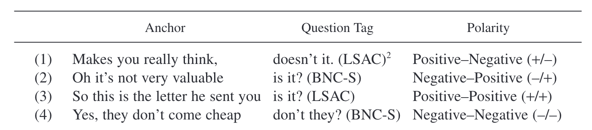
			- syntactic structure
			  collapsed:: true
				- This type of tag question consists of two clauses,
				  collapsed:: true
					- an anchor
					- and a tag.
				- The **subject**
				  collapsed:: true
					- in the anchor can be
					  collapsed:: true
						- a full noun phrase,
						- a pronoun,
						- or *there*,
					- but in the tag, it must be either
					  collapsed:: true
						- a personal pronoun,
						- *there*, or
						- *one*.
				- The **verb**
				  collapsed:: true
					- in the anchor can be
					  collapsed:: true
						- a lexical verb,
						- an auxiliary,
						- or a modal verb;
					- the verb in the tag must be
					  collapsed:: true
						- an auxiliary
						- or a modal.
			- polarity
			  collapsed:: true
				- There can be **reversed polarity** (positive–negative or negative–positive) in the anchor clause and the following question tag, as in (1) and (2);
				- **constant positive polarity**, as in (3);
				- or **constant negative polarity**, as in (4), a rare type whose existence has occasionally been questioned (see e.g., Quirk et al. 1985, 813) but of which we have found some genuine examples.”
		- constraints
		  collapsed:: true
			- preceding *wh*-words
			  collapsed:: true
				- “One constraint was to disallow instances with a wh-word (or a wh-word followed by a noun) immediately preceding the potential tag as in (6) and (7):
				  collapsed:: true
					- (6) Hello, how are you? (BNC-S)
					- (7) What number is it? (BNC-S)”
			- subsequent verbs
			  collapsed:: true
				- “Another constraint excluded sentences with a verb immediately following the pronoun, as in (8) and (9):
				  collapsed:: true
					- (8) Doesn’t he like the vet? (BNC-S)
					- (9) Hasn’t he improved? (BNC-S)”
			- subsequent adjectives
			  collapsed:: true
				- “A third constraint excluded examples containing an adjective immediately following the pronoun of the potential question tag, as in (10) and (11):
				  collapsed:: true
					- (10) Are they comfortable? (BNC-S)
					- (11) Are you happy to do it...?(BNC-S)”
		- random sample
		  collapsed:: true
			- “We therefore worked with a random subset of these, which yielded a total of 4,973 relevant instances. Frequency figures for BNC-S are therefore based on extrapolation rather than full manual counts. However, given the high number of relevant instances, we are confident that our results are valid.”
		- pragmatic functions
		  collapsed:: true
			- 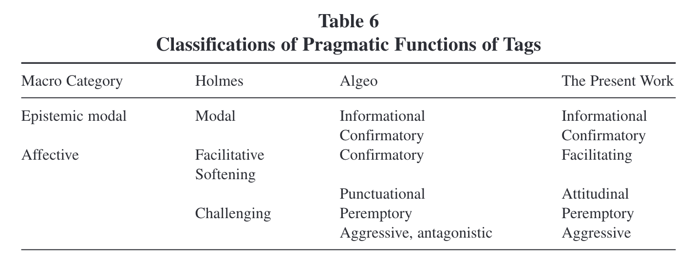
		- results
		  collapsed:: true
			- [[British English]] vs [[American English]]
			  collapsed:: true
				- 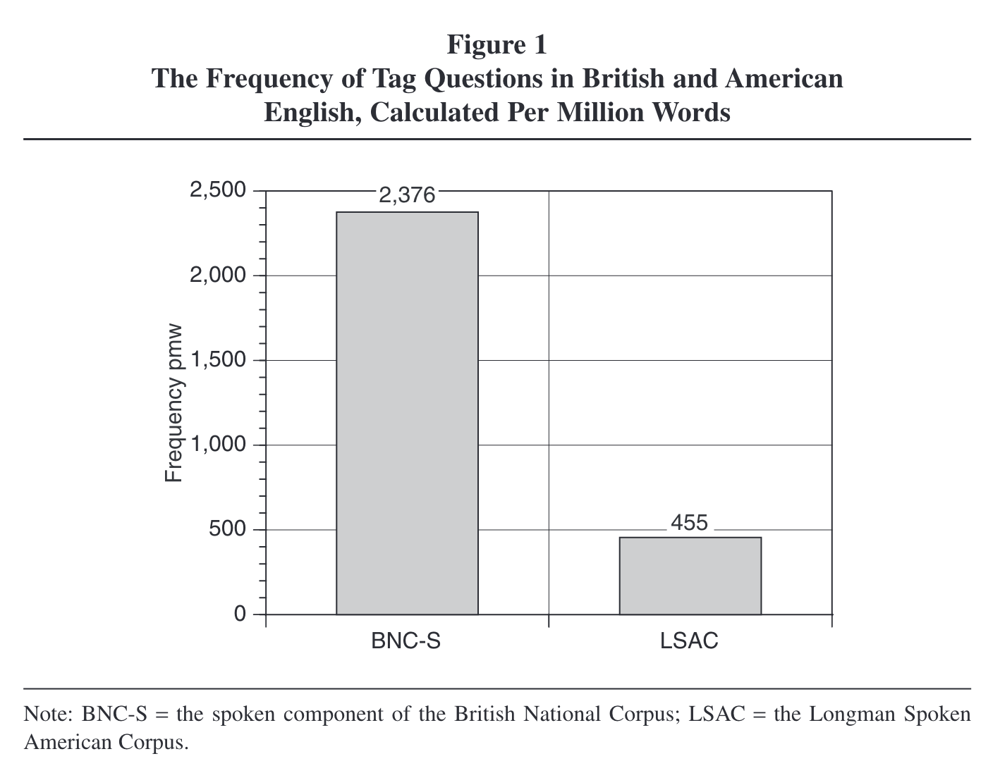
			- polarity
			  collapsed:: true
				- Based on two samples of 1,000 instances each, we found that positive–negative polarity tag constructions are indeed the most frequent choice in both varieties, accounting for 75 percent of the totals in British and 69 percent in American English.” (p. 289)
				- 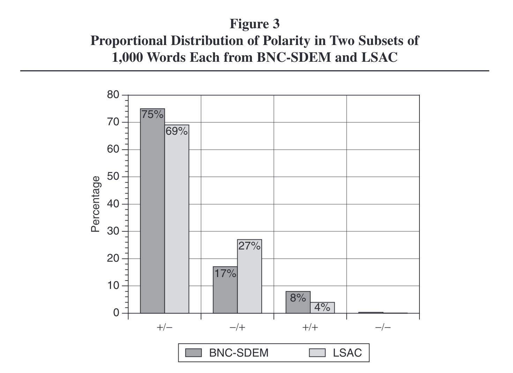
			- auxiliary use
			  collapsed:: true
				- 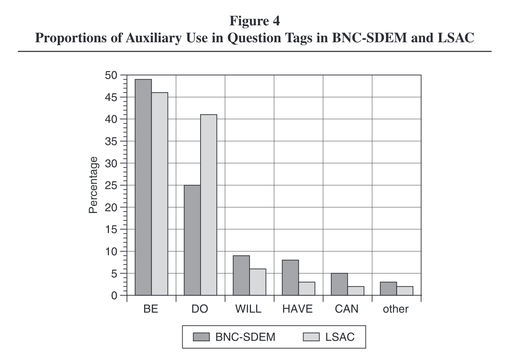
			- pronouns
			  collapsed:: true
				- 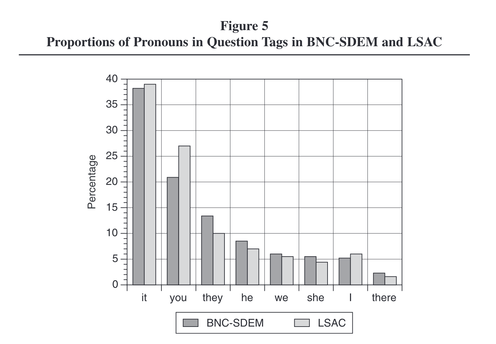
			- phrases
			  collapsed:: true
				- 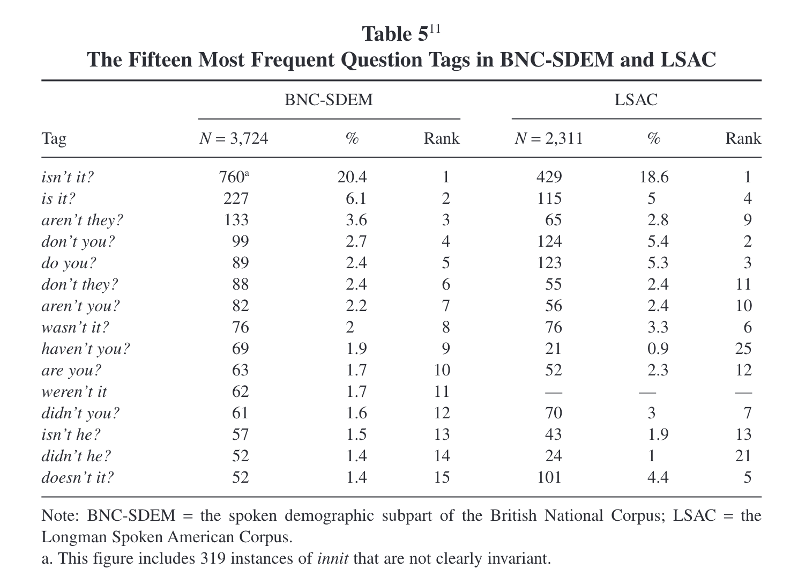
			- pragmatic functions
			  collapsed:: true
				- 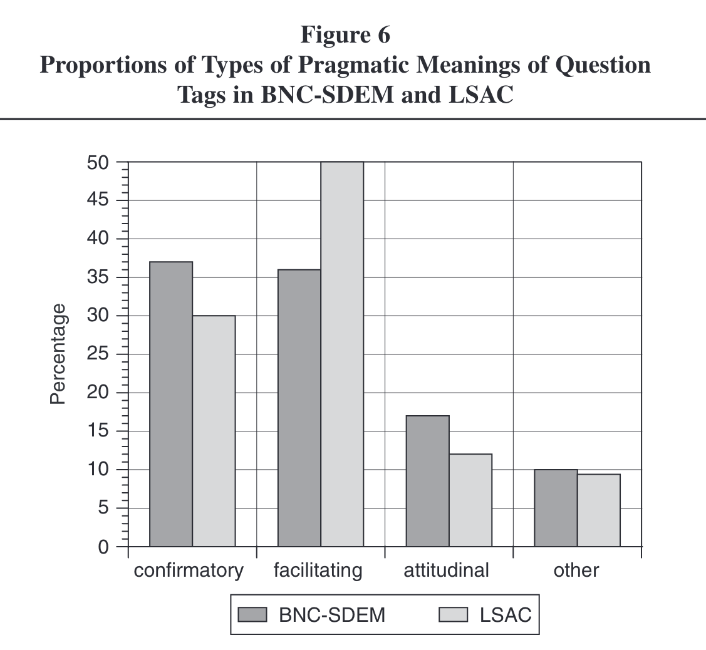
			- sociolinguistic variation
			  collapsed:: true
				- [[gender]]
				  collapsed:: true
					- 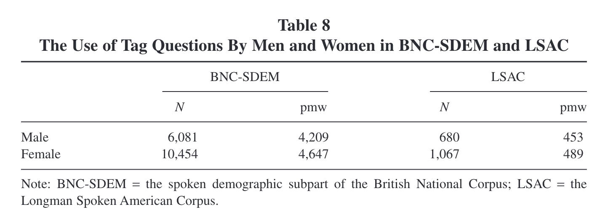
				- [[age]]
				  collapsed:: true
					- 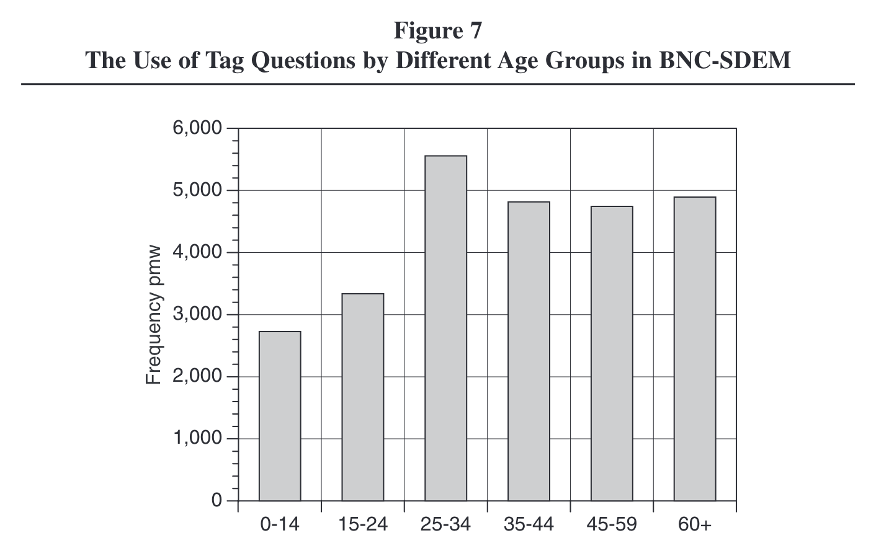
					- 
					- “It seems highly probable that what we see here is not a development toward fewer tags in younger people but a shift in the type of tags used by different age groups, a hypothesis that is at least partially supported by a preliminary study of British English by Serino (2006).” (p. 306)
	- [[practice]]: study question tags in the [BNC 2014 Spoken]([[BNC/2014/spoken]]) using [[Sketch Engine]]
		- retrieve attestations of question tags
		  collapsed:: true
			- create and refine a query to collect question tags
			  collapsed:: true
				- 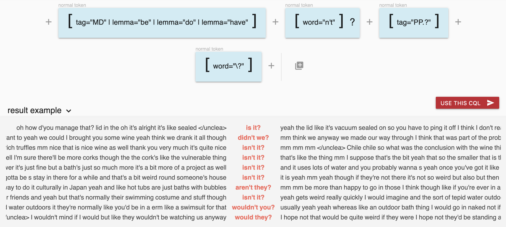
				- `[tag="MD" | lemma="be" | lemma="do" | lemma="have"] [word="n't"]?  [tag="PP.?"] [word="\?"]`
				- https://ske.li/questiontagsbnc
			- evaluate false positive rate
			  collapsed:: true
				- use [[Sketch Engine]] download a [[random sample]] of 50 hits
				- use [[Microsoft Excel]] to annotate and analyse it
				  collapsed:: true
					- model sheet: https://1drv.ms/x/s!AvkgNVl9yS6aokmqDbTz5BmfbU6C
					- add a column named `Label`
					- annotate each attestation with
					  collapsed:: true
						- `0`: no question tag → false positive
						- `1`: question tag → true positive
					- think about how you could reduce false positives
					  collapsed:: true
						- either in SkE by refining your query
						  collapsed:: true
							- exclude instances at utterances start
							  collapsed:: true
								- collapsed:: true
								  ```
								  <u> []{1,} 1:[tag="MD" | lemma="be" | lemma="do" | lemma="have"] [word="n't"]? [tag="PP.?"] [word="\?"] within <u/>
								  ```
							- exclude *wh*-words preceding the pattern (like *when* and *where*)
							  collapsed:: true
								- collapsed:: true
								  ```
								  <u> []{1,} [lemma!="where|who|which|when"] [tag="MD" | lemma="be" | lemma="do" | lemma="have"] [word="n't"]?  [tag="PP.?"] [word="\?"]  within <u/>
								  ```
						- or in Excel using filters (see model sheet)
					- analyse false positive rate
					  collapsed:: true
						- {:height 414, :width 389}
		- determine most frequent question tag forms
		  collapsed:: true
			- individual phrases (e.g. *is n't it* vs *are n't you*)
			- most frequent pronouns
			- most frequent verbs
			  collapsed:: true
				- `[tag="V.*" | tag="MD"]  within [tag="MD" | lemma="be" | lemma="do" | lemma="have"] [word="n't"]?  [tag="PP.?"] [word="\?"]`
				- https://ske.li/questiontagsverbs
		- analyse sociolinguistic variation (→ frequency by `Text Type`)
		  collapsed:: true
			- age: `Age range`
			- gender: `Gender`
			- social grade: `Class: Social grade`
			- education: `Highest qualification`
		- investigate polarity
		  collapsed:: true
			- collapsed:: true
			  ```
			  [tag="V.*"] [word="n't" | word="not"] []{1,} [tag="MD" | lemma="be" | lemma="do" | 
			  lemma="have"] [word="n't"]?  [tag="PP.?"] [word="\?"]  within <u/>
			  ```
			- https://ske.li/questiontagspolarity
- recap
	- note-taking
	  collapsed:: true
		- principles
		  collapsed:: true
			- principles
		- [[Logseq]]
		  collapsed:: true
			- 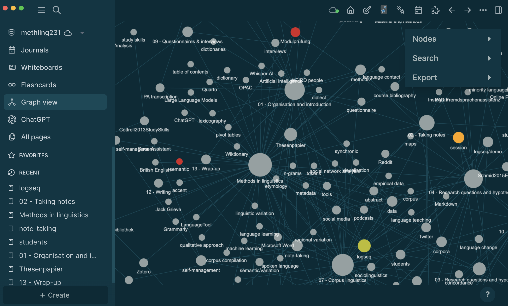
	- research questions and hypotheses
	  collapsed:: true
		- {{embed ((645a6da4-1124-46e4-9517-512df2067082))}}
	- managing references
	  collapsed:: true
		- finding references
		  collapsed:: true
			- {{embed ((6463abc3-0579-42db-a65b-ccff44da6659))}}
			- {{embed ((6463abc3-ff8d-4f47-ab62-7f0ded4e8dcb))}}
			- {{embed ((6463ac07-9c1a-422a-80f3-ecb9d4829181))}}
		- citing references
		  collapsed:: true
			- {{embed ((6463b3b6-b8a2-4693-a21b-8f118d92cb95))}}
		- managing your library
		  collapsed:: true
			- {{embed ((6463a7be-7bb4-4623-9c5c-bf1a18a0da2b))}}
	- reading
	  collapsed:: true
		- {{embed ((6476206a-e328-42f8-b979-21b21eb36b90))}}
		- {{embed ((6476206a-220f-4cc7-8fc4-9111db544a3f))}}
	- self-management
	  collapsed:: true
		- {{embed ((647619b5-2f34-4eae-8fb4-6bac8253eba9))}}
		- {{embed ((647619b5-5152-44b7-9478-2217cfe63a89))}}
		- {{embed ((647619b5-776f-42db-b9a4-99655c7b26a3))}}
	- corpus linguistics
	  collapsed:: true
		- fundamental concepts
		  collapsed:: true
			- {{embed ((648033b8-e219-444d-83dd-04c79b44530c))}}
			- {{embed ((648033b8-7985-4fca-b09e-e5f18cfe1862))}}
		- english-corpora.org
		  collapsed:: true
			- {{embed ((648967e3-a1bb-43dc-957b-4e95eb21822b))}}
			- {{embed ((64896809-e84c-4885-bf8f-f1b73181834f))}}
		- Sketch Engine
		  collapsed:: true
			- compiling your own corpora
			  collapsed:: true
				- {{embed ((24c49678-34c1-4521-b793-c485e372e3e0))}}
	- questionnaires
	  collapsed:: true
		- {{embed ((64929eaa-570c-4600-ad1e-6eab1e9b50c6))}}
	- data analysis
	  collapsed:: true
		- {{embed ((faa8080e-11c0-4b48-856e-4b4dd8c6c365))}}
		- {{embed ((47c6f7a8-a572-4ea8-a61e-2b31641b34f6))}}
		- {{embed ((649bccb1-2184-4e95-8e2d-e719c4755401))}}
		- pivot tables and pivot charts
		  collapsed:: true
			- ((649bccb1-6ddc-4061-a266-5566888ab58b))
	- writing
	  collapsed:: true
		- structure
		  collapsed:: true
			- {{embed ((64ad7d2f-fcd8-4c49-a57b-946b3984a34a))}}
		- ((64ad829f-41b9-4d5c-9105-376d416c09fc))
		- ((64ad85a7-6160-48e1-87f3-04010036c02e))
		- {{embed ((64ad7c6d-6063-4529-b7de-3421d62a34db))}}