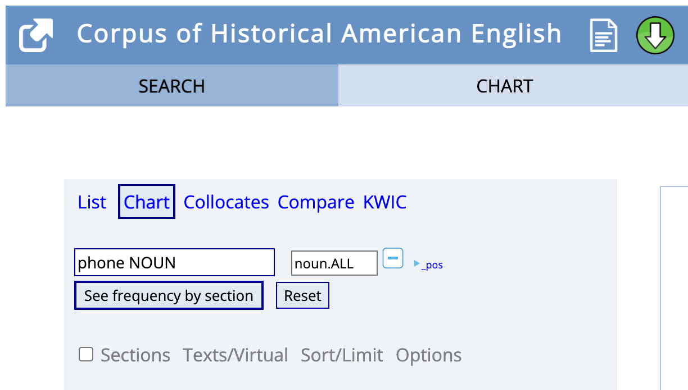
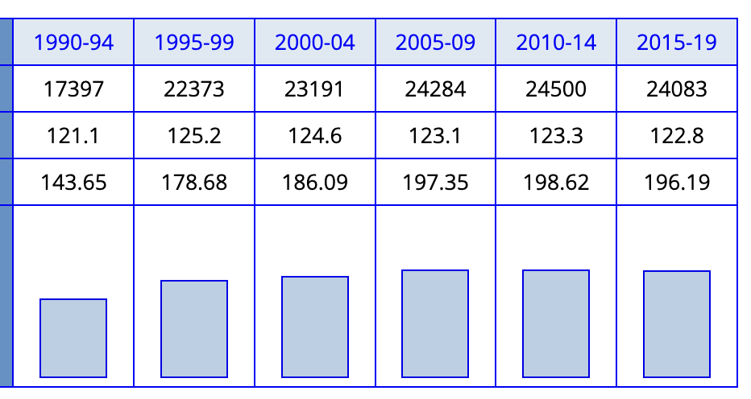
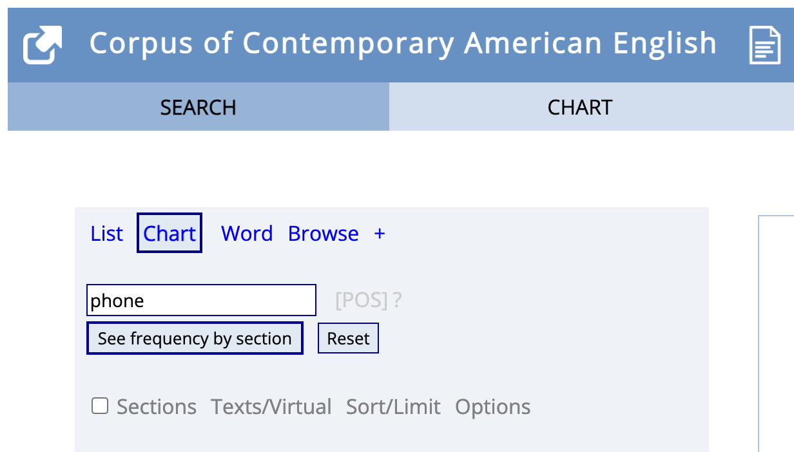

- URL: [english-corpora.org](https://www.english-corpora.org/)
id:: 64802ffe-9f9e-493e-822e-3539f3675c02
- overview of corpora
  collapsed:: true
	- 
- features
  collapsed:: true
	- concordances
	  collapsed:: true
		- 
	- chart view
	  collapsed:: true
		- 
	- for =phone=
	- query by word classes
	  collapsed:: true
		- 
		- 
	- collocations
	  collapsed:: true
		- all adjectives preceding the word =girl=
		  collapsed:: true
			- 
			- 
		- all adjectives preceding the word =boy=
		  collapsed:: true
			- 
- types of analyses
  collapsed:: true
	- diachronic analyses
	  collapsed:: true
		- how to
		  collapsed:: true
			- using the =chart= view:
			  collapsed:: true
			                  
		- COHA
		  collapsed:: true
			- 
			  collapsed:: true
			                  query for =phone=
		- COCA
		  collapsed:: true
			- 
			  collapsed:: true
			                  query for =phone=
		- the NOW corpus
		  collapsed:: true
			- 
			  collapsed:: true
			                  query for =phone=
		- ...
	- text type variation
	  collapsed:: true
		- how to
		  collapsed:: true
			- use =chart= view
			  collapsed:: true
			                  
		- e.g. COCA
		  collapsed:: true
			- query for =phone=
			  collapsed:: true
			                  
	- geospatial variation
	  collapsed:: true
		- e.g. NOW corpus
		  collapsed:: true
			- use =chart= view
			  collapsed:: true
				- 
			- =see frequency by country=
			  collapsed:: true
				- 
			- results
			  collapsed:: true
				- 